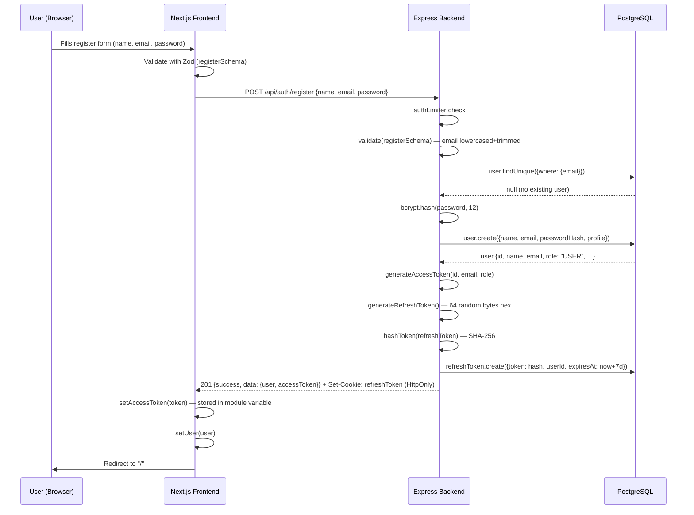
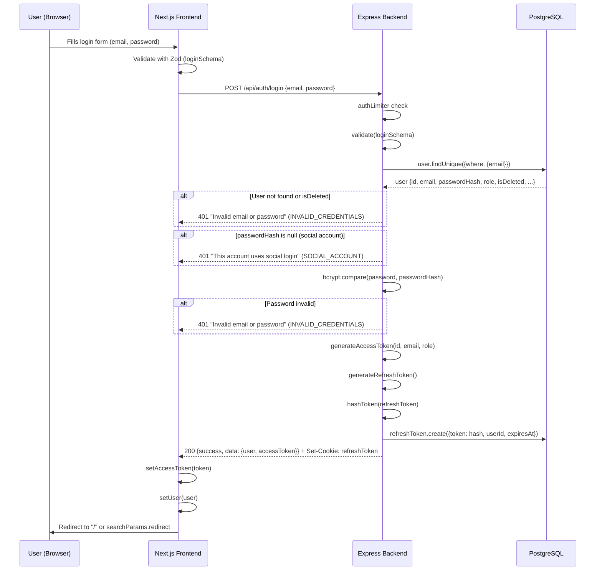
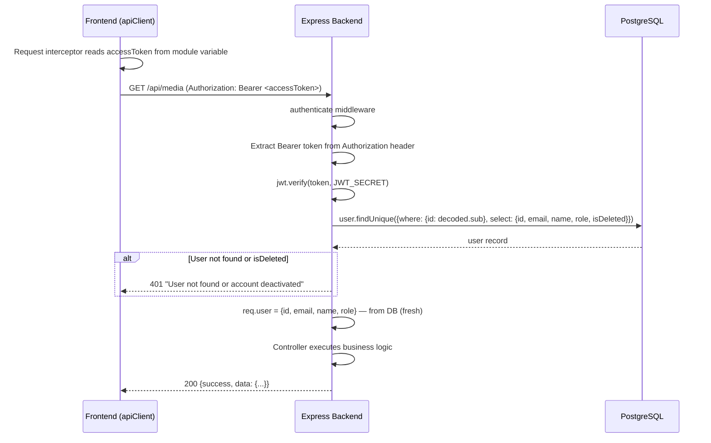
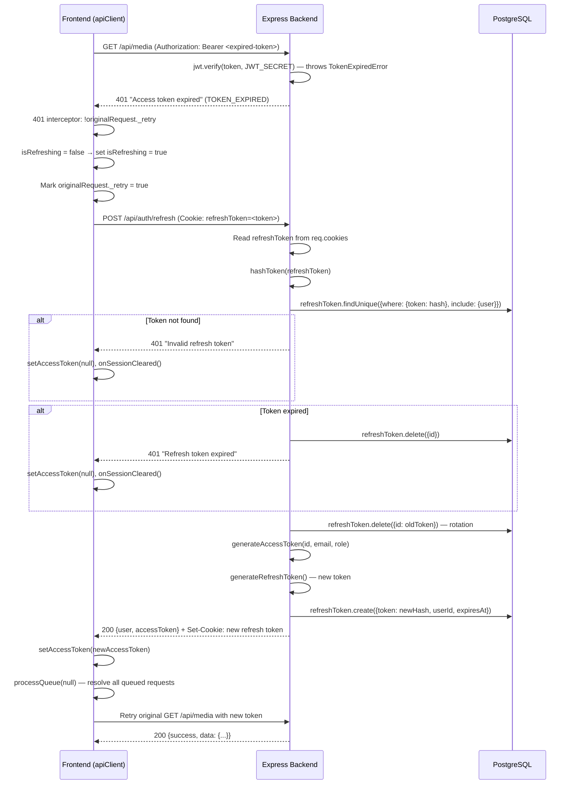
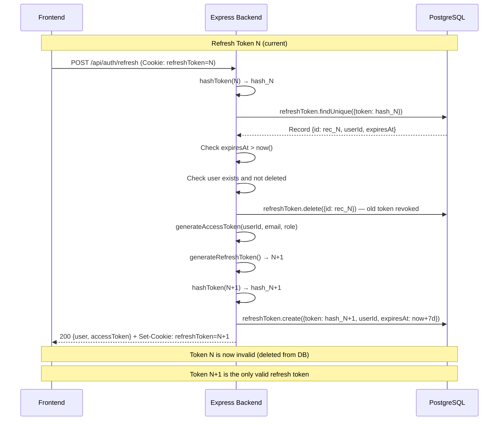
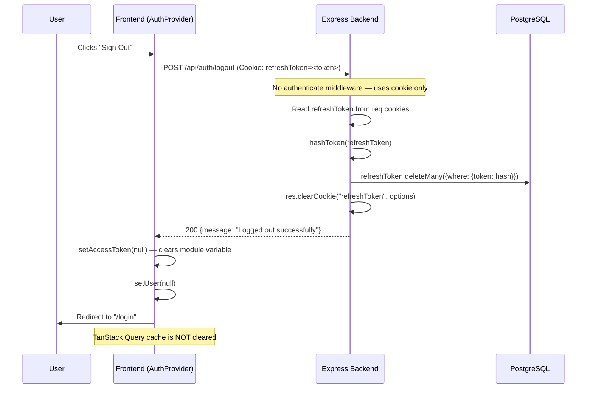
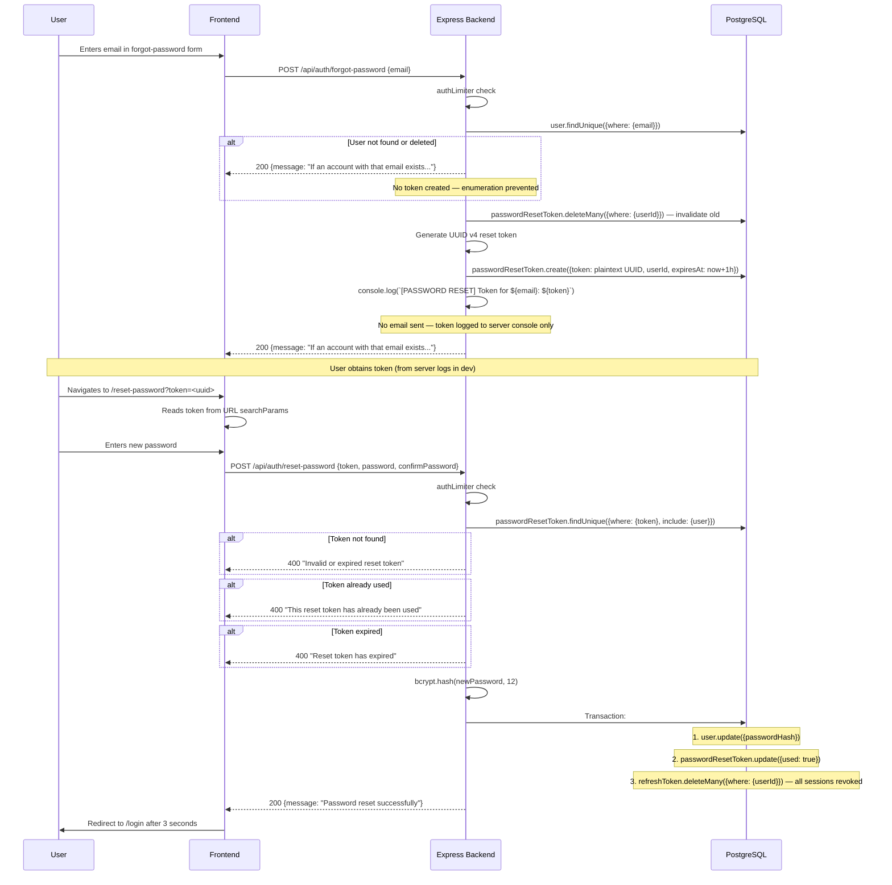
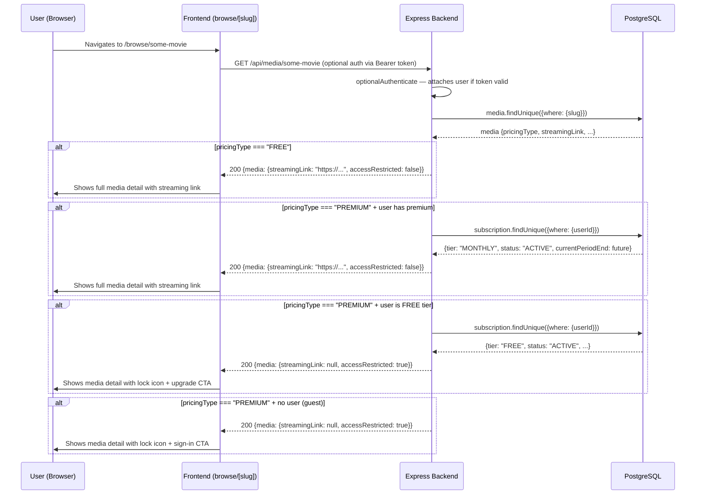
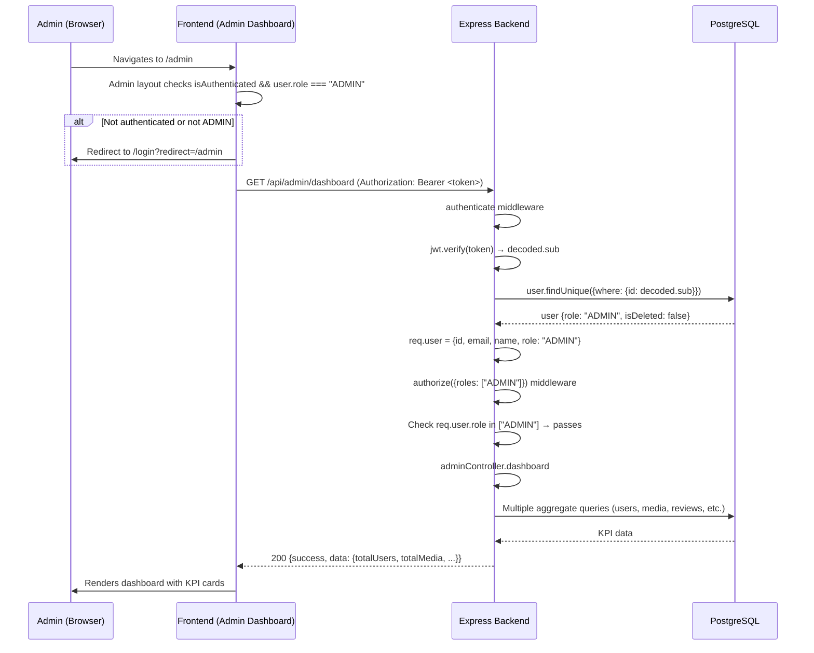

# CineTube Authentication Flow Diagrams

> **Discovery date:** 2026-07-13  
> **Reference:** `docs/clineteube-upgrade/03-auth-authorization-subscription-audit.md`

All diagrams are based on verified source-code evidence. Only interactions confirmed in the repository are included.

---

## 1. Registration Flow



---

## 2. Login Flow



---

## 3. Access-Token API Request



---

## 4. Expired Access Token and Refresh



---

## 5. Refresh-Token Rotation



---

## 6. Logout Flow



---

## 7. Forgot/Reset Password Flow



---

## 8. Premium Media Access



---

## 9. Admin API Request



---

## Diagram Notes

### Authentication State Summary
| State | Access Token | Refresh Cookie | DB Refresh Record |
|---|---|---|---|
| Logged out | `null` | Absent | None |
| Logged in | JWT in memory | Present (HttpOnly) | Hashed token |
| Token expired | Expired JWT | Present | Hashed token |
| After refresh | New JWT | New cookie | New hashed token |
| After logout | `null` | Cleared | Deleted |
| After password reset | `null` (stale) | Cleared (stale) | All deleted |

### Token Flow Summary
```
Registration/Login → Generate access + refresh → Store hash in DB → Cookie + memory
API Request → Verify JWT → Re-fetch user from DB → Execute handler
401 Response → Refresh interceptor → POST /auth/refresh → Rotate → Retry
Logout → Delete DB record → Clear cookie → Clear memory
Password Reset → Delete ALL refresh records → Clear all sessions
```
