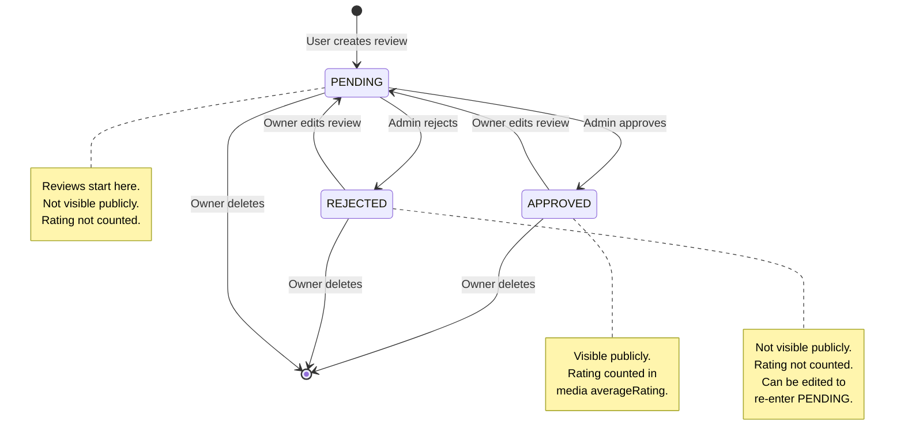
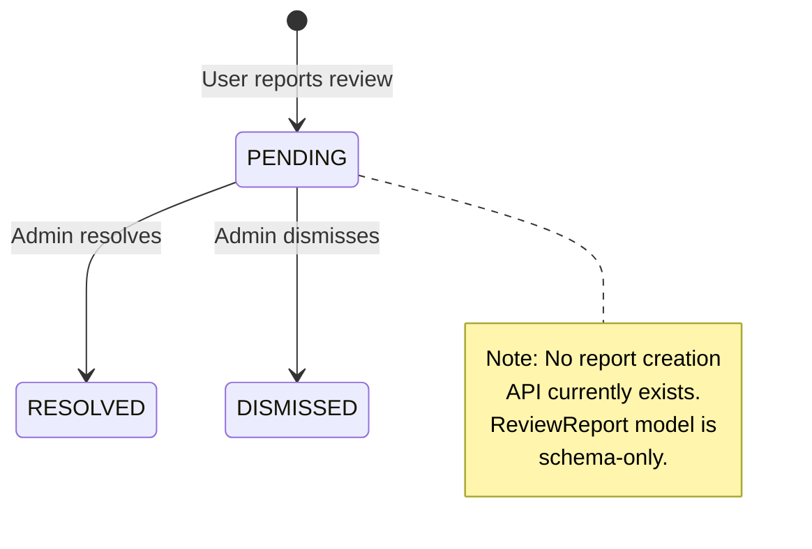
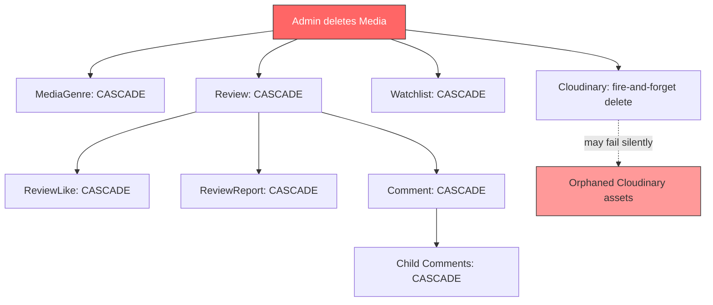
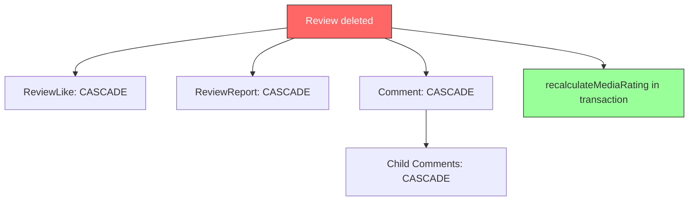
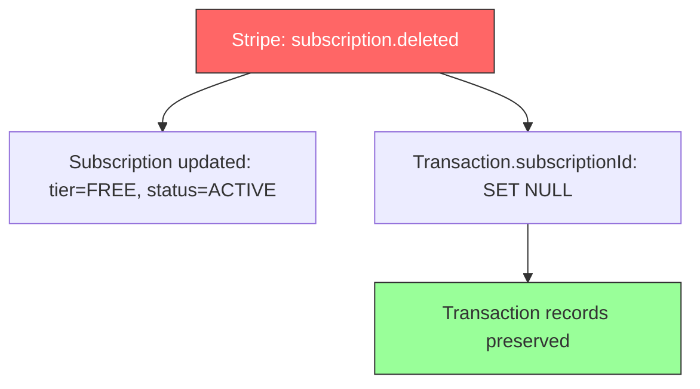

# CineTube Data Model Diagrams

> **Discovery date:** 2026-07-13  
> **Reference:** `docs/clineteube-upgrade/05-database-schema-and-integrity-audit.md`

All diagrams are based on the verified `prisma/schema.prisma` and confirmed application usage.

---

## 1. Complete Entity-Relationship Model

```mermaid
erDiagram
    User ||--o| UserProfile : has
    User ||--o{ Account : has
    User ||--o{ RefreshToken : has
    User ||--o{ PasswordResetToken : has
    User ||--o{ Review : writes
    User ||--o{ ReviewLike : likes
    User ||--o{ ReviewReport : reports
    User ||--o{ Comment : writes
    User ||--o{ Watchlist : saves
    User ||--o| Subscription : has
    User ||--o{ Transaction : pays

    Media ||--o{ MediaGenre : has
    Genre ||--o{ MediaGenre : belongs
    Media ||--o{ Review : receives
    Media ||--o{ Watchlist : saved_in

    Review ||--o{ ReviewLike : has
    Review ||--o{ ReviewReport : has
    Review ||--o{ Comment : has

    Comment ||--o{ Comment : replies

    Subscription ||--o{ Transaction : records

    User {
        uuid id PK
        string name
        string email UK
        string passwordHash
        enum role
        datetime emailVerified
        string image
        boolean isDeleted
        datetime deletedAt
        datetime createdAt
        datetime updatedAt
    }

    UserProfile {
        uuid id PK
        uuid userId FK UK
        text bio
        string[] favoriteGenres
        string website
        string twitter
        string facebook
        string github
        datetime createdAt
        datetime updatedAt
    }

    Account {
        uuid id PK
        uuid userId FK
        string type
        string provider
        string providerAccountId
        text refresh_token
        text access_token
        int expires_at
        string token_type
        string scope
        text id_token
        string session_state
        datetime createdAt
        datetime updatedAt
    }

    RefreshToken {
        uuid id PK
        string token UK
        uuid userId FK
        datetime expiresAt
        datetime createdAt
    }

    PasswordResetToken {
        uuid id PK
        string token UK
        uuid userId FK
        datetime expiresAt
        boolean used
        datetime createdAt
    }

    Media {
        uuid id PK
        varchar title
        string slug UK
        text synopsis
        enum type
        enum pricingType
        string streamingLink
        string posterUrl
        string posterPublicId
        string backdropUrl
        string backdropPublicId
        int releaseYear
        varchar director
        string[] cast
        decimal averageRating
        int reviewsCount
        int viewCount
        datetime createdAt
        datetime updatedAt
    }

    Genre {
        uuid id PK
        string name UK
    }

    MediaGenre {
        uuid mediaId PK_FK
        uuid genreId PK_FK
        datetime createdAt
    }

    Review {
        uuid id PK
        smallint rating
        text content
        string[] tags
        boolean spoilerWarning
        enum status
        datetime publishedAt
        uuid userId FK
        uuid mediaId FK
        datetime createdAt
        datetime updatedAt
    }

    ReviewLike {
        uuid userId PK_FK
        uuid reviewId PK_FK
        datetime createdAt
    }

    ReviewReport {
        uuid id PK
        uuid reviewId FK
        uuid userId FK
        enum reason
        text details
        enum status
        datetime createdAt
        datetime updatedAt
    }

    Comment {
        uuid id PK
        text content
        uuid userId FK
        uuid reviewId FK
        uuid parentId FK
        datetime createdAt
        datetime updatedAt
    }

    Watchlist {
        uuid userId PK_FK
        uuid mediaId PK_FK
        datetime createdAt
    }

    Subscription {
        uuid id PK
        uuid userId FK UK
        enum tier
        enum status
        string stripeCustomerId UK
        string stripeSubscriptionId UK
        datetime currentPeriodStart
        datetime currentPeriodEnd
        datetime createdAt
        datetime updatedAt
    }

    Transaction {
        uuid id PK
        uuid userId FK
        uuid subscriptionId FK
        decimal amount
        varchar currency
        enum status
        varchar provider
        string providerTxnId UK
        varchar type
        datetime createdAt
    }
```

---

## 2. User and Authentication Relationships

```mermaid
erDiagram
    User ||--o| UserProfile : "1:0..1 profile"
    User ||--o{ Account : "1:0..* OAuth"
    User ||--o{ RefreshToken : "1:0..* sessions"
    User ||--o{ PasswordResetToken : "1:0..* resets"
    User ||--o| Subscription : "1:0..1 billing"

    User {
        uuid id PK
        string email UK
        string passwordHash "nullable for OAuth"
        enum role "USER or ADMIN"
        boolean isDeleted "soft delete"
    }

    UserProfile {
        uuid userId FK UK
        text bio
        string[] favoriteGenres
        string website
        string twitter
        string facebook
        string github
    }

    Account {
        uuid id PK
        uuid userId FK "CASCADE"
        string provider
        string providerAccountId
        text access_token
        text refresh_token
    }

    RefreshToken {
        uuid id PK
        string token UK "SHA-256 hash"
        uuid userId FK "CASCADE"
        datetime expiresAt "7 days"
    }

    PasswordResetToken {
        uuid id PK
        string token UK "plaintext UUID"
        uuid userId FK "CASCADE"
        datetime expiresAt "1 hour"
        boolean used
    }

    Subscription {
        uuid id PK
        uuid userId FK UK "CASCADE"
        enum tier "FREE MONTHLY YEARLY"
        enum status "ACTIVE CANCELED INCOMPLETE PAST_DUE TRIALING"
        string stripeCustomerId UK
        string stripeSubscriptionId UK
    }
```

---

## 3. Media, Genre, Review, and Engagement Relationships

```mermaid
erDiagram
    Media ||--o{ MediaGenre : "N:M via join"
    Genre ||--o{ MediaGenre : "N:M via join"
    Media ||--o{ Review : "receives"
    Media ||--o{ Watchlist : "saved in"
    Review ||--o{ ReviewLike : "liked by"
    Review ||--o{ ReviewReport : "reported"
    Review ||--o{ Comment : "discussed"
    Comment ||--o{ Comment : "nested replies"

    User ||--o{ Review : "writes"
    User ||--o{ ReviewLike : "likes"
    User ||--o{ Comment : "writes"
    User ||--o{ Watchlist : "saves"

    Media {
        uuid id PK
        string slug UK
        enum type "MOVIE SERIES"
        enum pricingType "FREE PREMIUM"
        decimal averageRating "derived from reviews"
        int reviewsCount "derived from reviews"
        int viewCount "atomic increment"
    }

    Genre {
        uuid id PK
        string name UK
    }

    MediaGenre {
        uuid mediaId PK_FK "CASCADE"
        uuid genreId PK_FK "CASCADE"
    }

    Review {
        uuid id PK
        smallint rating "1-10"
        enum status "PENDING APPROVED REJECTED"
        uuid userId FK "CASCADE"
        uuid mediaId FK "CASCADE"
    }

    ReviewLike {
        uuid userId PK_FK "CASCADE"
        uuid reviewId PK_FK "CASCADE"
    }

    ReviewReport {
        uuid id PK
        uuid reviewId FK "CASCADE"
        uuid userId FK "CASCADE"
        enum reason
        enum status "PENDING RESOLVED DISMISSED"
    }

    Comment {
        uuid id PK
        uuid userId FK "CASCADE"
        uuid reviewId FK "CASCADE"
        uuid parentId FK "self-ref CASCADE"
    }

    Watchlist {
        uuid userId PK_FK "CASCADE"
        uuid mediaId PK_FK "CASCADE"
    }
```

---

## 4. Subscription and Transaction Relationships

```mermaid
erDiagram
    User ||--o| Subscription : "has"
    Subscription ||--o{ Transaction : "records"
    User ||--o{ Transaction : "owns"

    User {
        uuid id PK
        string email UK
    }

    Subscription {
        uuid id PK
        uuid userId FK UK "CASCADE"
        enum tier "FREE MONTHLY YEARLY"
        enum status "ACTIVE CANCELED PAST_DUE"
        string stripeCustomerId UK
        string stripeSubscriptionId UK
        datetime currentPeriodStart
        datetime currentPeriodEnd
    }

    Transaction {
        uuid id PK
        uuid userId FK "CASCADE"
        uuid subscriptionId FK "SET NULL"
        decimal amount "Decimal 10,2 major units"
        varchar currency "default USD"
        enum status "SUCCESS only in practice"
        varchar provider "stripe"
        string providerTxnId UK "idempotency key"
        varchar type "SUBSCRIPTION"
    }
```

---

## 5. Review/Comment Moderation Lifecycle





---

## 6. Important Delete/Cascade Paths

### User Deletion (Soft Delete — No Hard Delete API)

```mermaid
graph TD
    A[User.softDelete] -.->|Not implemented| B[UserProfile: CASCADE]
    A -.->|Not implemented| C[Account: CASCADE]
    A -.->|Not implemented| D[RefreshToken: CASCADE]
    A -.->|Not implemented| E[PasswordResetToken: CASCADE]
    A -.->|Not implemented| F[Review: CASCADE]
    A -.->|Not implemented| G[ReviewLike: CASCADE]
    A -.->|Not implemented| H[ReviewReport: CASCADE]
    A -.->|Not implemented| I[Comment: CASCADE]
    A -.->|Not implemented| J[Watchlist: CASCADE]
    A -.->|Not implemented| K[Subscription: CASCADE]
    A -.->|Not implemented| L[Transaction: CASCADE]

    style A fill:#f66,stroke:#333,color:#fff
    style B fill:#ff9,stroke:#333
    style C fill:#ff9,stroke:#333
    style D fill:#ff9,stroke:#333
    style E fill:#ff9,stroke:#333
    style F fill:#ff9,stroke:#333
    style G fill:#ff9,stroke:#333
    style H fill:#ff9,stroke:#333
    style I fill:#ff9,stroke:#333
    style J fill:#ff9,stroke:#333
    style K fill:#ff9,stroke:#333
    style L fill:#ff9,stroke:#333
```



**Note:** Only soft-delete (`isDeleted=true`) is implemented. If a hard `DELETE` were executed, all cascaded data would be permanently lost, including transaction history.

### Media Deletion (Admin API)



### Review Deletion (Owner or Admin via Media Deletion)



### Subscription Deletion (Stripe Webhook)



---

## Diagram Notes

### Cardinality Legend
- `||--||` = one-to-one (exactly one)
- `||--o|` = one-to-zero-or-one
- `||--o{` = one-to-zero-or-many
- `}o--o{` = many-to-many

### Cascade Legend
- `CASCADE` = child deleted when parent deleted
- `SET NULL` = child FK set to null when parent deleted
- `RESTRICT` = delete blocked if children exist

### Key Design Decisions Confirmed
1. All PKs are UUID strings (generated by Prisma)
2. All user-owned data cascades on user deletion
3. Transaction history preserved via SET NULL on subscription FK
4. Composite PKs for join/association tables (MediaGenre, ReviewLike, Watchlist)
5. Self-referencing Comment with CASCADE for recursive deletion
6. Soft delete only on User model
7. Denormalized rating fields on Media maintained by application transactions
