# CineTube Payment Flow Diagrams

> **Discovery date:** 2026-07-13  
> **Reference:** `docs/clineteube-upgrade/07-stripe-subscription-and-payment-audit.md`

All diagrams are based on verified source-code evidence. Only interactions confirmed in the repository are included.

---

## 1. Checkout Initiation

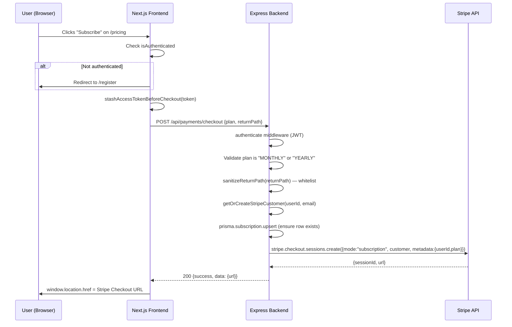

---

## 2. Stripe Hosted Checkout Redirect

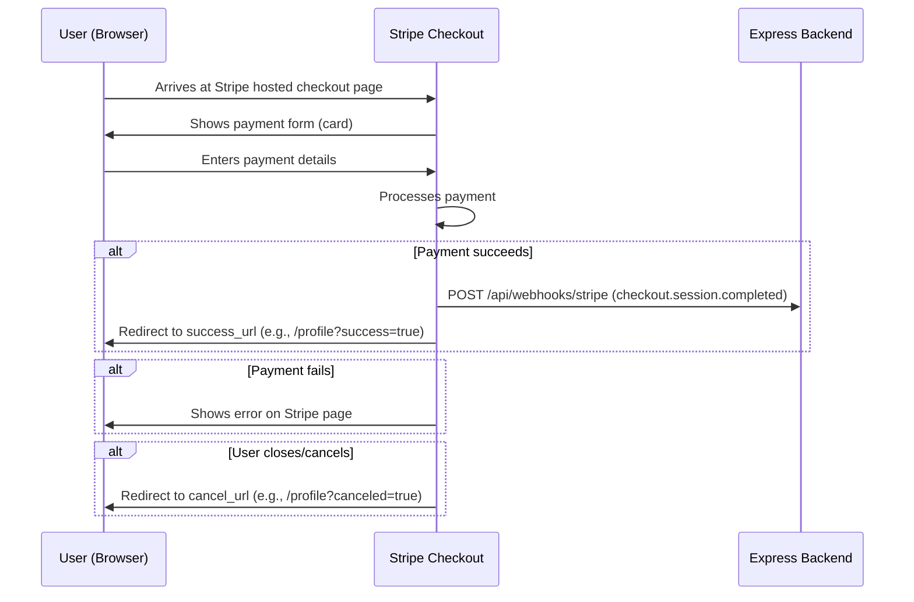

---

## 3. Checkout Success Return

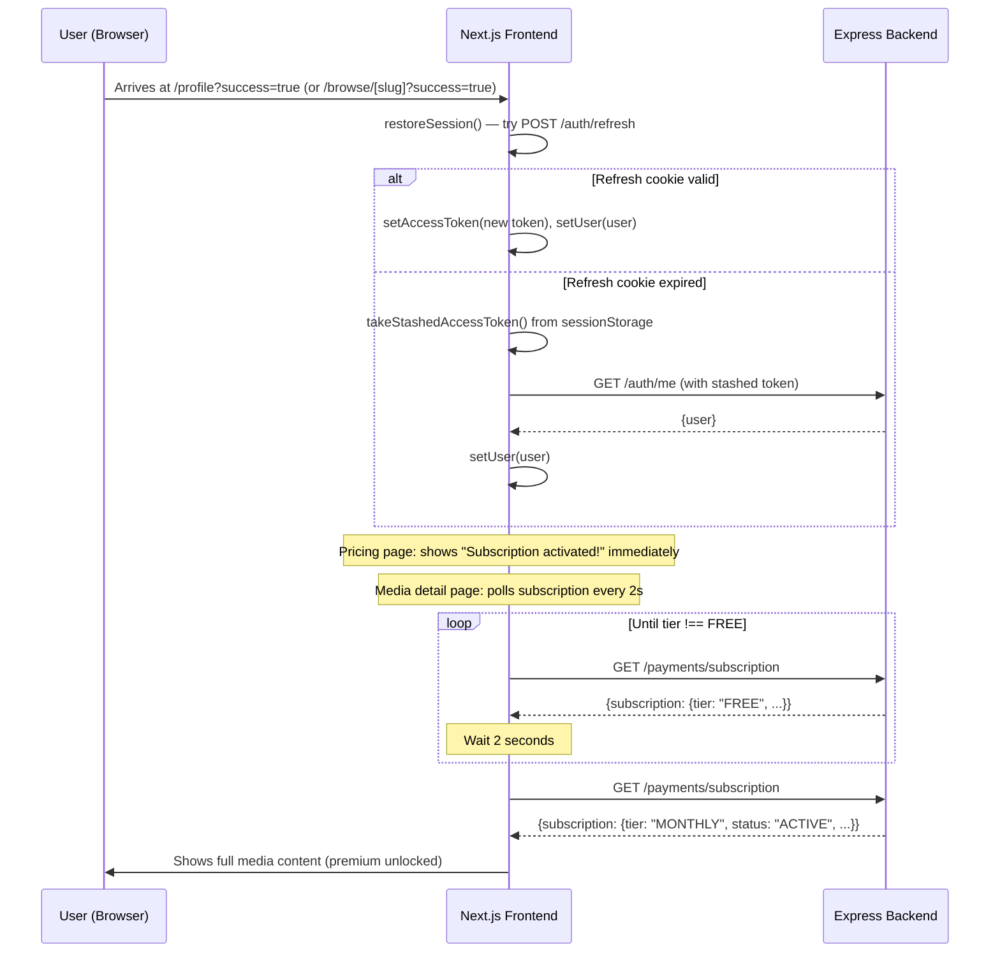

---

## 4. `checkout.session.completed` Webhook

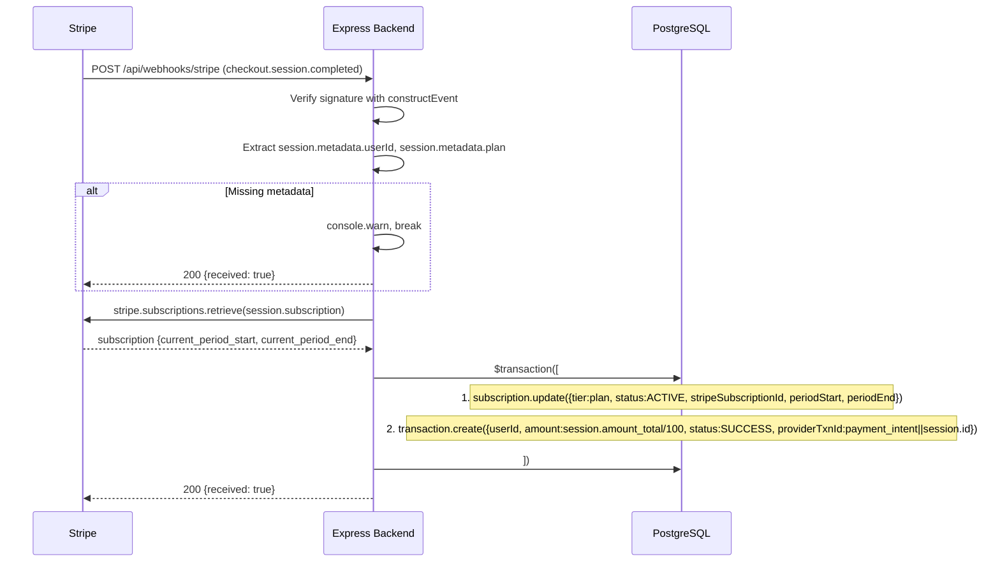

---

## 5. `invoice.paid` Webhook

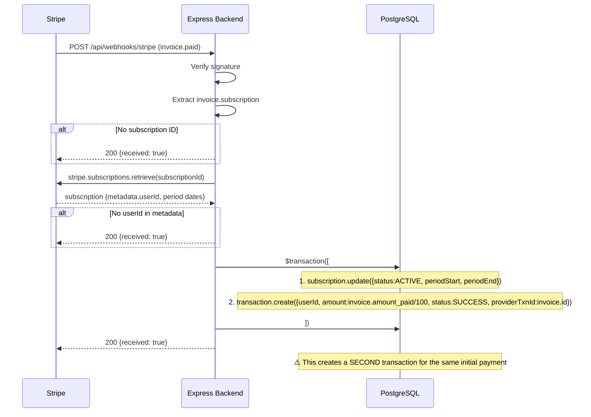

---

## 6. `invoice.payment_failed` Webhook

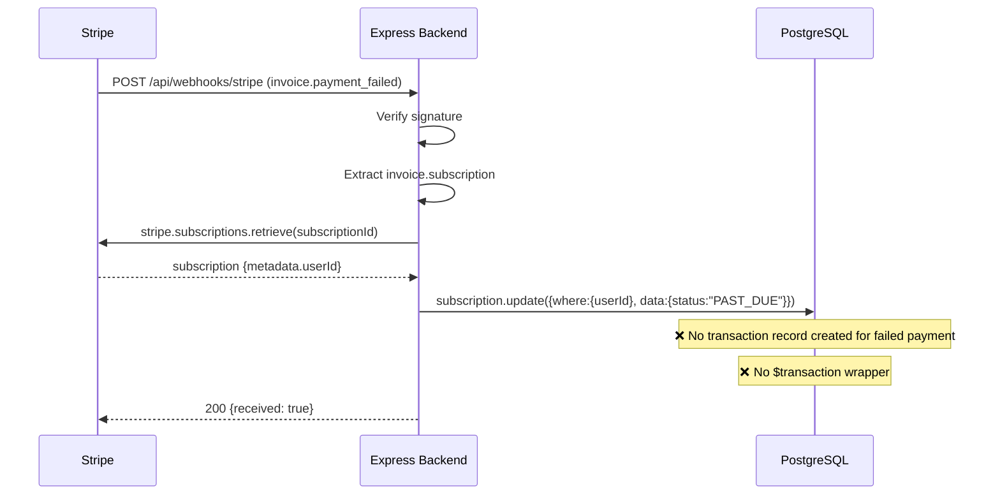

---

## 7. `customer.subscription.updated` Webhook

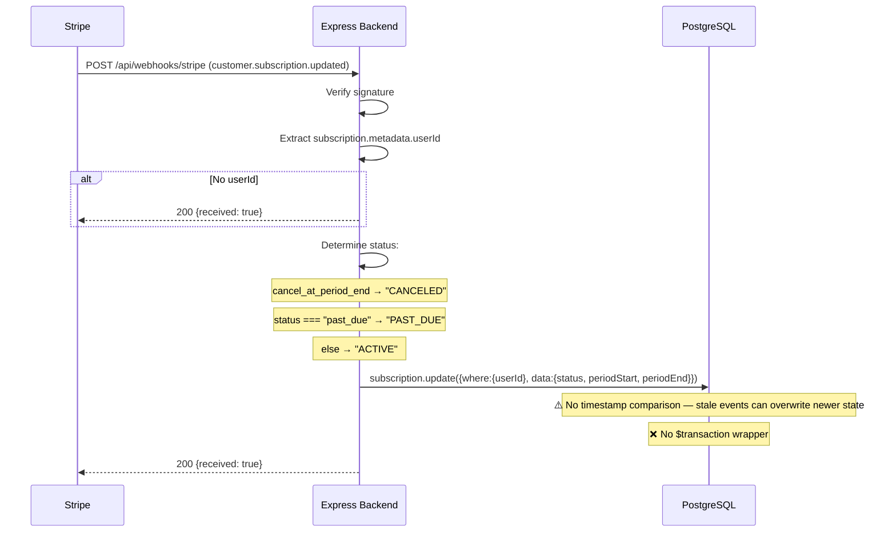

---

## 8. `customer.subscription.deleted` Webhook

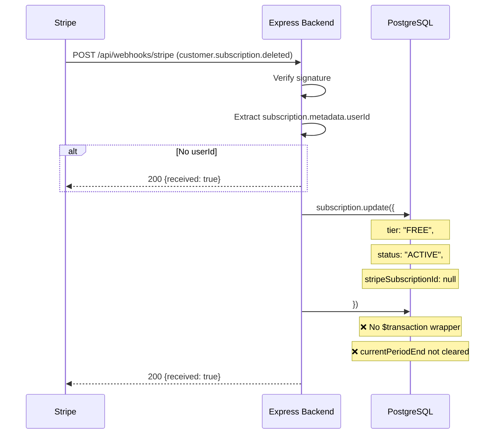

---

## 9. Cancellation at Period End

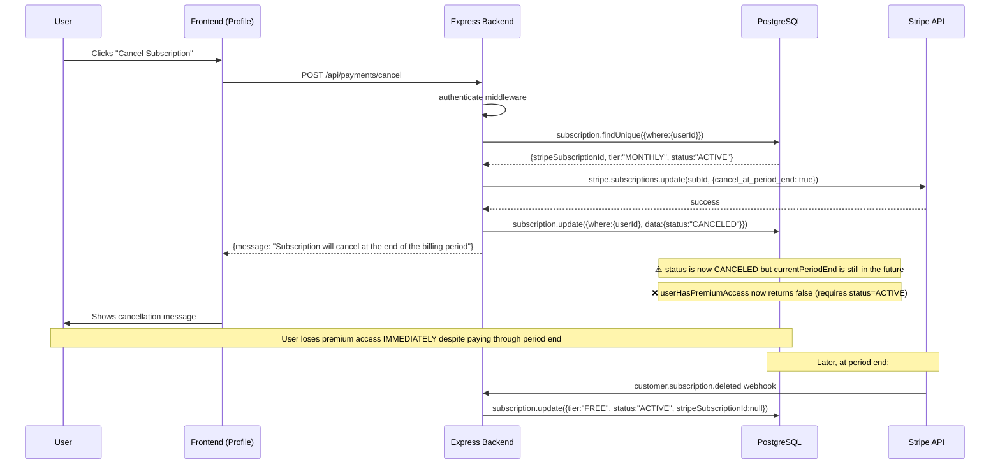

---

## 10. Premium-Content Entitlement Check

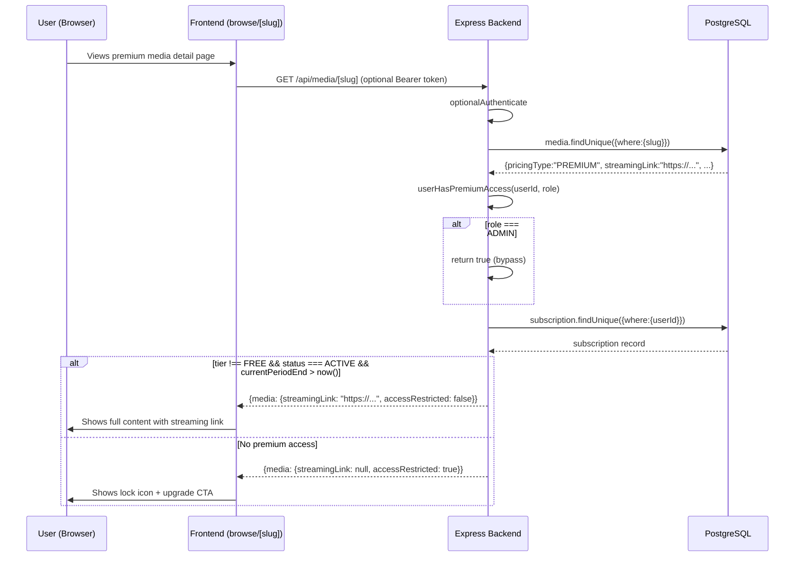

---

## 11. Duplicate Webhook Delivery

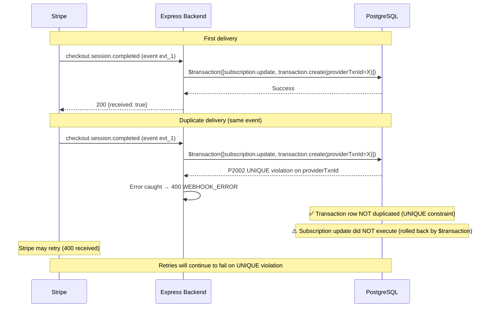

---

## 12. Delayed Webhook After Frontend Return

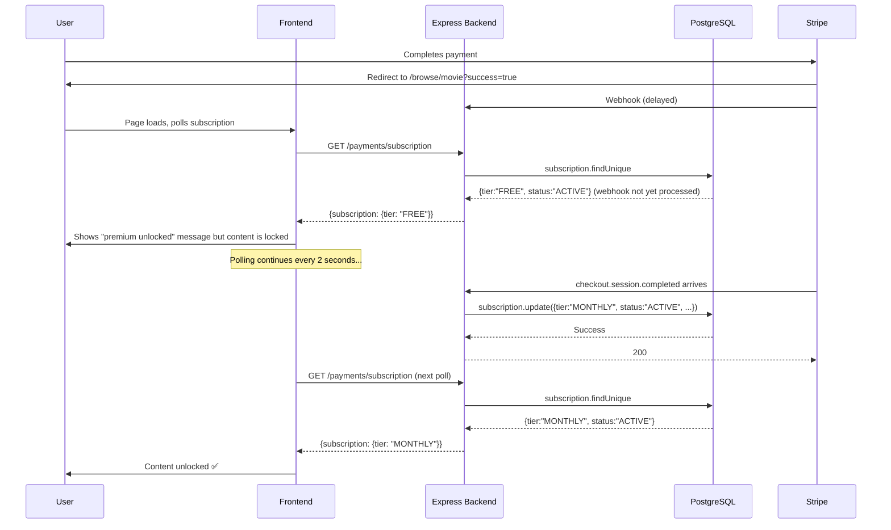

---

## 13. Database Failure During Webhook

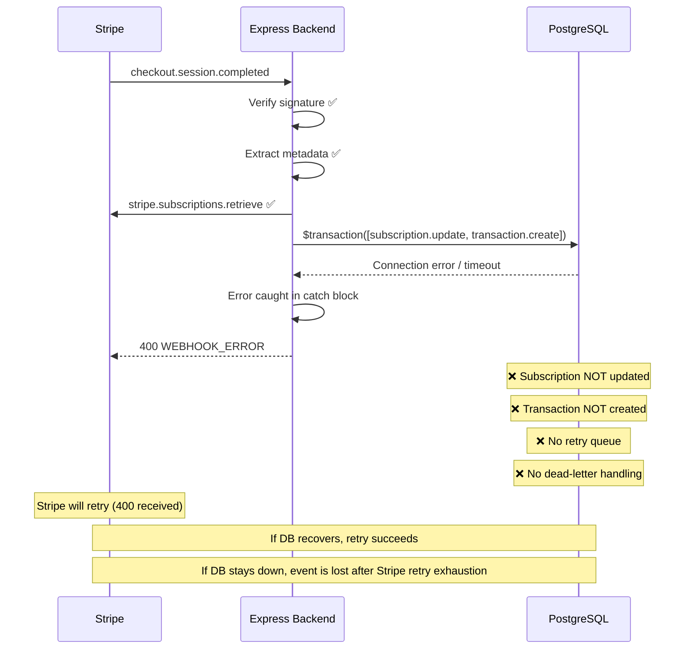

---

## 14. Re-subscription After Cancellation

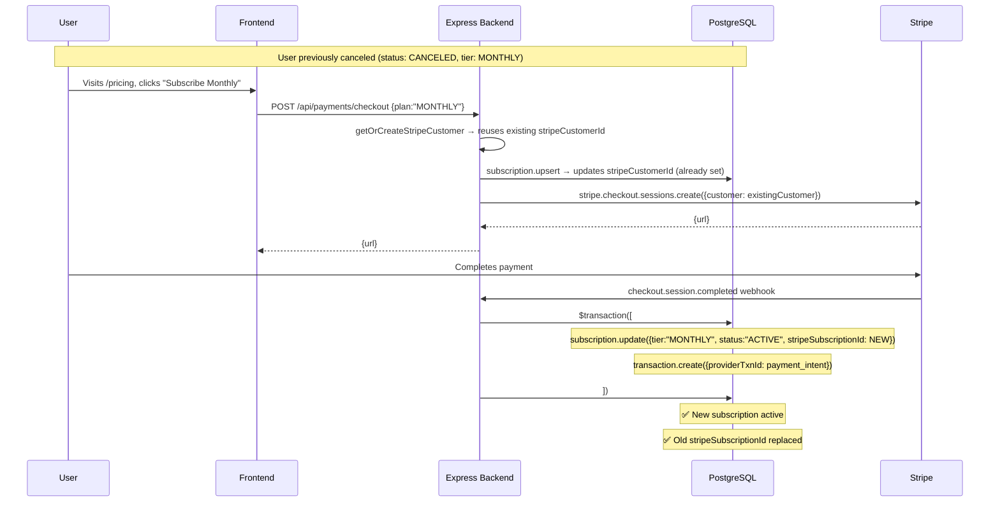

---

## Diagram Notes

### Critical Timing Issues
1. **Frontend return before webhook:** The `?success=true` URL param triggers optimistic UI, but actual entitlement depends on webhook processing.
2. **Cancellation immediate effect:** DB status changes to `CANCELED` before billing period ends, breaking premium access.
3. **Double transaction on initial payment:** Both `checkout.session.completed` and `invoice.paid` create Transaction rows.

### Failure Recovery Summary
| Failure | Auto Recovery | Mechanism |
|---|---|---|
| Webhook delayed | ✅ Frontend polling | `refetchInterval: 2000` |
| Webhook fails (DB error) | ⚠️ Stripe retries | 400 response triggers retry |
| Duplicate webhook | ✅ Transaction UNIQUE | P2002 prevents duplicate row |
| Subscription drift | ❌ None | No reconciliation |
| Double transaction | ❌ None | No deduplication |
