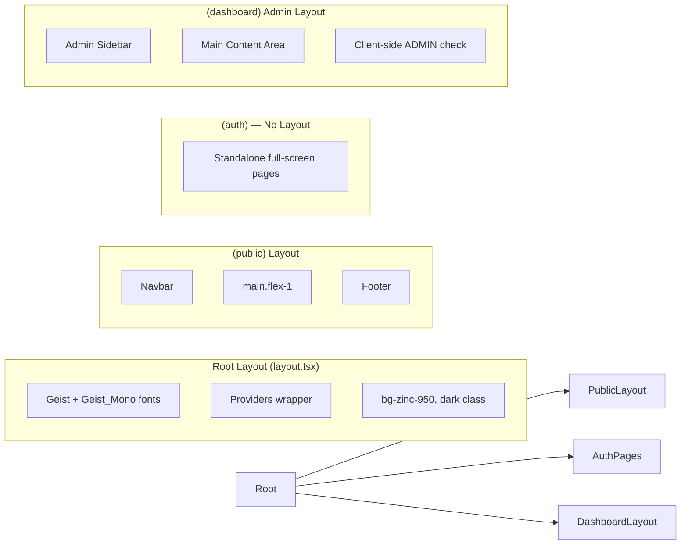
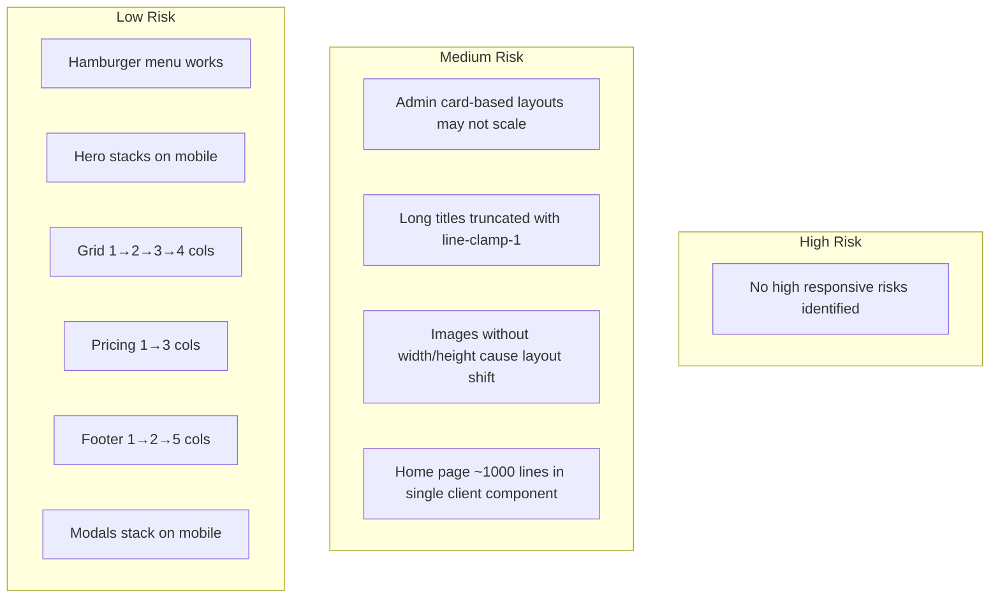
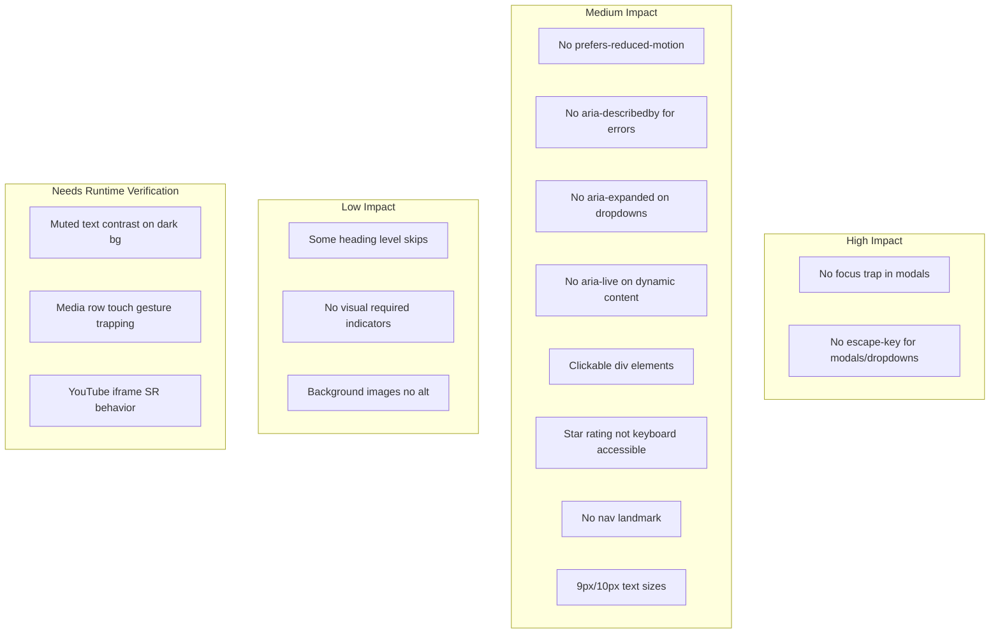

# CineTube Frontend Page and Component Map

> **Discovery date:** 2026-07-13  
> **Reference:** `docs/clineteube-upgrade/09-frontend-ui-accessibility-responsive-audit.md`

---

## 1. Complete Frontend Component Tree

```mermaid
graph TD
    Root[frontend/src/app/layout.tsx] --> Providers[frontend/src/providers/index.tsx]
    Providers --> AuthProvider[auth-provider.tsx]
    Providers --> QueryProvider[query-provider.tsx]

    Root --> PublicLayout[frontend/src/app/(public)/layout.tsx]
    PublicLayout --> Navbar[frontend/src/components/navbar.tsx]
    PublicLayout --> Footer[frontend/src/components/footer.tsx]

    Root --> AuthPages[frontend/src/app/(auth)/*]
    Root --> DashboardLayout[frontend/src/app/(dashboard)/admin/layout.tsx]

    PublicLayout --> HomePage[page.tsx]
    PublicLayout --> BrowsePage[browse/page.tsx]
    PublicLayout --> DetailPage[browse/[slug]/page.tsx]
    PublicLayout --> PricingPage[pricing/page.tsx]
    PublicLayout --> ProfilePage[profile/page.tsx]
    PublicLayout --> WatchlistPage[watchlist/page.tsx]

    AuthPages --> LoginPage[login/page.tsx]
    AuthPages --> RegisterPage[register/page.tsx]
    AuthPages --> ForgotPage[forgot-password/page.tsx]
    ResetPage[reset-password/page.tsx]

    DashboardLayout --> AdminPage[admin/page.tsx]
    DashboardLayout --> AdminMedia[admin/media/page.tsx]
    DashboardLayout --> AdminMediaCreate[admin/media/create/page.tsx]
    DashboardLayout --> AdminMediaEdit[admin/media/[id]/edit/page.tsx]
    DashboardLayout --> AdminReviews[admin/reviews/page.tsx]

    DetailPage --> ReviewForm[components/review-form.tsx]
    DetailPage --> ReviewList[components/review-list.tsx]
    DetailPage --> MyReviewPanel[components/my-review-panel.tsx]
    DetailPage --> CommentSection[components/comment-section.tsx]

    AdminMediaCreate --> ImageUpload[components/image-upload.tsx]
    AdminMediaEdit --> ImageUpload
    ProfilePage -.-> ImageUpload

    subgraph "UI Components (frontend/src/components/ui/)"
        Button[button.tsx]
        Input[input.tsx]
        Textarea[textarea.tsx]
        Select[select.tsx]
        Label[label.tsx]
        Card[card.tsx]
        Badge[badge.tsx]
        Alert[alert.tsx]
        Accordion[accordion.tsx]
        Separator[separator.tsx]
    end
```

---

## 2. Route-to-Layout Map



---

## 3. Route-to-Shared-Component Map

| Route | Navbar | Footer | Button | Card | Input | Badge | Alert | Accordion | Select | ImageUpload | ReviewForm | CommentSection |
|---|---|---|---|---|---|---|---|---|---|---|---|---|
| `/` | ✅ | ✅ | ✅ | ✅ | — | ✅ | — | ✅ | — | — | — | — |
| `/browse` | ✅ | ✅ | ✅ | ✅ | ✅ | ✅ | — | — | ✅ | — | — | — |
| `/browse/[slug]` | ✅ | ✅ | ✅ | ✅ | — | ✅ | ✅ | — | — | — | ✅ | ✅ |
| `/pricing` | ✅ | ✅ | ✅ | ✅ | — | ✅ | ✅ | ✅ | — | — | — | — |
| `/profile` | ✅ | ✅ | ✅ | ✅ | ✅ | ✅ | ✅ | — | — | — | — | — |
| `/watchlist` | ✅ | ✅ | ✅ | ✅ | — | ✅ | — | — | — | — | — | — |
| `/login` | — | — | ✅ | — | ✅ | — | ✅ | — | — | — | — | — |
| `/register` | — | — | ✅ | — | ✅ | — | ✅ | — | — | — | — | — |
| `/forgot-password` | — | — | ✅ | — | ✅ | — | ✅ | — | — | — | — | — |
| `/reset-password` | — | — | ✅ | — | ✅ | — | ✅ | — | — | — | — | — |
| `/admin` | — | — | ✅ | ✅ | — | ✅ | — | — | — | — | — | — |
| `/admin/media` | — | — | ✅ | ✅ | ✅ | ✅ | — | — | — | — | — | — |
| `/admin/media/create` | — | — | ✅ | ✅ | ✅ | ✅ | ✅ | — | ✅ | ✅ | — | — |
| `/admin/media/[id]/edit` | — | — | ✅ | ✅ | ✅ | ✅ | ✅ | — | ✅ | ✅ | — | — |
| `/admin/reviews` | — | — | ✅ | ✅ | — | ✅ | — | — | — | — | — | — |

---

## 4. Form Inventory

| Form | Location | Fields | Client Validation | Server Validation | Labels | Loading | Success | Error | Status |
|---|---|---|---|---|---|---|---|---|---|
| Login | `(auth)/login/page.tsx` | email, password | Zod (loginSchema) | Zod (loginSchema) | ✅ | ✅ Spinner | ❌ | ✅ Alert | Complete |
| Register | `(auth)/register/page.tsx` | name, email, password, confirmPassword | Zod (registerSchema) | Zod (registerSchema) | ✅ | ✅ Spinner | ❌ | ✅ Alert | Complete |
| Forgot Password | `(auth)/forgot-password/page.tsx` | email | Zod (forgotPasswordSchema) | Zod (forgotPasswordSchema) | ✅ | ✅ Spinner | ✅ Alert | ✅ Alert | Complete |
| Reset Password | `(auth)/reset-password/page.tsx` | token(hidden), password, confirmPassword | Zod (resetPasswordSchema) | Zod (resetPasswordSchema) | ✅ | ✅ Spinner | ✅ Alert | ✅ Alert | Complete |
| Profile Edit | `(public)/profile/page.tsx` | name, bio, website, twitter, facebook, github, favoriteGenres | Inline checks | Zod (updateProfileSchema) | ✅ | ✅ Spinner | ✅ Alert | ✅ Alert | Complete |
| Review Create/Edit | `components/review-form.tsx` | rating, content, tags, spoilerWarning | Zod (reviewSchema) | Zod (createReviewSchema) | ✅ | ✅ Spinner | ❌ | ✅ Alert | Complete |
| Comment | `components/comment-section.tsx` | content | Min length check | Zod (createCommentSchema) | ❌ | ✅ Spinner | ❌ | ✅ Inline | Partial |
| Media Create | `admin/media/create/page.tsx` | title, synopsis, type, pricingType, streamingLink, releaseYear, director, cast, genreIds, poster, backdrop | Manual checks | Zod (createMediaSchema) | ✅ | ✅ Spinner | ❌ | ✅ Alert | Complete |
| Media Edit | `admin/media/[id]/edit/page.tsx` | Same as create | Same | Zod (updateMediaSchema) | ✅ | ✅ Spinner | ❌ | ✅ Alert | Complete |
| Newsletter | `components/footer.tsx` | email | HTML required | ❌ None | ❌ | ❌ | ❌ | ❌ | Non-functional |
| Search | `components/navbar.tsx` | search query | — | — | ❌ | — | — | — | Functional |
| Browse Filters | `(public)/browse/page.tsx` | search, type, genre, pricingType, sortBy | URL sync | API params | ✅ Select labels | ✅ Spinner | — | — | Complete |

---

## 5. Loading/Error/Empty-State Inventory

| Route | Loading State | Error State | Empty State | Protected |
|---|---|---|---|---|
| `/` | Spinner | ❌ None | N/A | No |
| `/browse` | Spinner | ❌ None | ✅ "No results" | No |
| `/browse/[slug]` | Spinner | ✅ Error alert | N/A | No |
| `/pricing` | Spinner | ❌ None | N/A | No |
| `/profile` | Spinner | ✅ Error alert | ✅ Sign-in prompt | Client |
| `/watchlist` | Spinner | ❌ None | ✅ Sign-in prompt / Empty list | Client |
| `/login` | — | ✅ Error alert | N/A | No |
| `/register` | — | ✅ Error alert | N/A | No |
| `/forgot-password` | — | ✅ Error alert | N/A | No |
| `/reset-password` | — | ✅ Error alert | N/A | No |
| `/admin` | Spinner | ❌ None | N/A | Client (ADMIN) |
| `/admin/media` | Spinner | ❌ None | ⚠️ Empty table | Client (ADMIN) |
| `/admin/media/create` | — | ✅ Error alert | N/A | Client (ADMIN) |
| `/admin/media/[id]/edit` | Spinner | ✅ Error alert | N/A | Client (ADMIN) |
| `/admin/reviews` | Spinner | ❌ None | ✅ "No reviews" | Client (ADMIN) |
| Global | `loading.tsx` spinner | `error.tsx` boundary | `not-found.tsx` 404 | — |

---

## 6. Hardcoded-Content Inventory

| Location | Content | Type | Lines | User-Visible |
|---|---|---|---|---|
| `page.tsx` | `HERO_CAROUSEL` (3 slides) | Hero slides | ~30-120 | ✅ |
| `page.tsx` | `EDITORS_PICKS` (3 items) | Curated grid | ~85-110 | ✅ |
| `page.tsx` | `FAQ_ITEMS` (5 items) | FAQ accordion | ~112-130 | ✅ |
| `page.tsx` | Pricing card data | Pricing tiers | ~700-850 | ✅ |
| `browse/page.tsx` | `GENRES` (10 items) | Filter dropdown | ~20 | ✅ |
| `footer.tsx` | Social links (4 `href="#"`) | Footer | ~29-80 | ✅ |
| `footer.tsx` | Legal links (3 `href="#"`) | Footer | ~191-197 | ✅ |
| `footer.tsx` | Genre links (4 items) | Footer | ~140-170 | ✅ |
| `footer.tsx` | Newsletter form | Footer | ~175-190 | ✅ |
| `navbar.tsx` | Notification bell + red dot | Navbar | ~130 | ✅ |
| `pricing/page.tsx` | FAQ items (4 items) | Pricing page | ~30-50 | ✅ |
| Seed data | `example.com/stream/*` URLs | Backend only | — | ❌ |
| Seed data | TMDB image URLs | Backend + Frontend | — | ✅ |

---

## 7. Responsive-Risk Map



---

## 8. Accessibility-Risk Map



---

## Component Usage Summary

### Most-Used Shared Components
1. **Button** — Used on every page
2. **Card** — Used on 10+ pages
3. **Badge** — Used on 8+ pages
4. **Input** — Used on 6 form pages
5. **Alert** — Used on 6 pages for error/success messages

### Least-Used Shared Components
1. **Separator** — Used on pricing/home pages only
2. **Accordion** — Used on home and pricing pages only
3. **Textarea** — Used on profile and review forms only

### Components Used Only in One Place
1. **ImageUpload** — Admin media create/edit only
2. **ReviewForm** — Media detail page only
3. **ReviewList** — Media detail page only
4. **MyReviewPanel** — Media detail page only
5. **CommentSection** — Media detail page only
