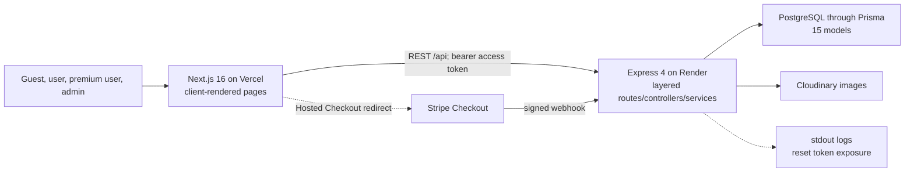
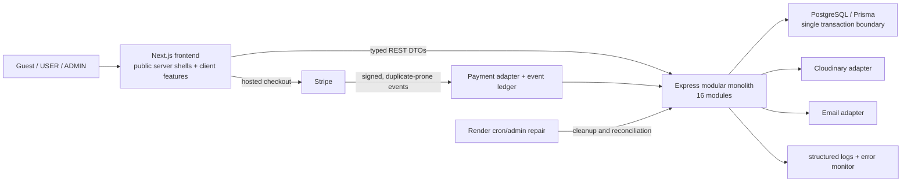
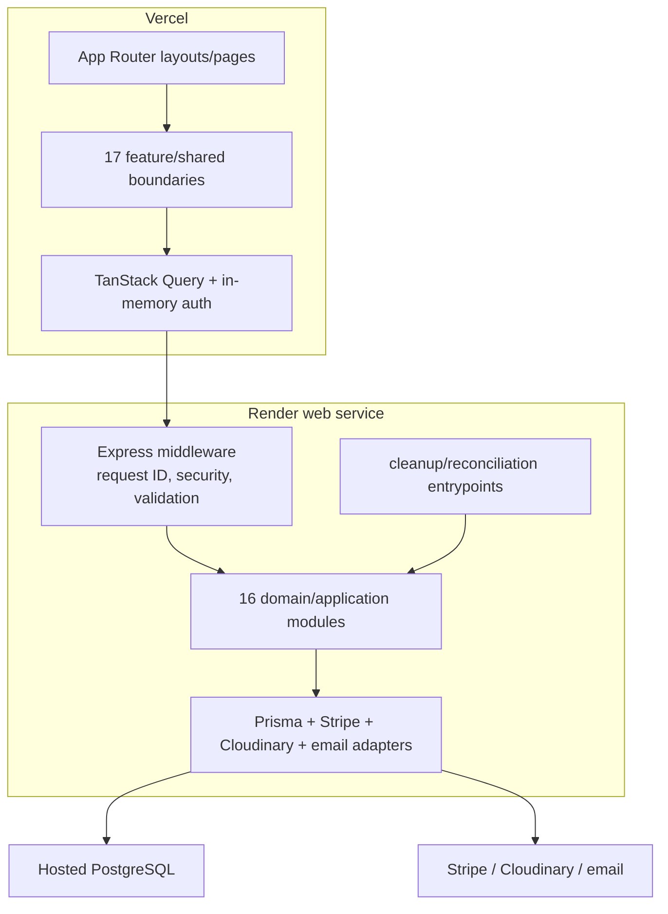
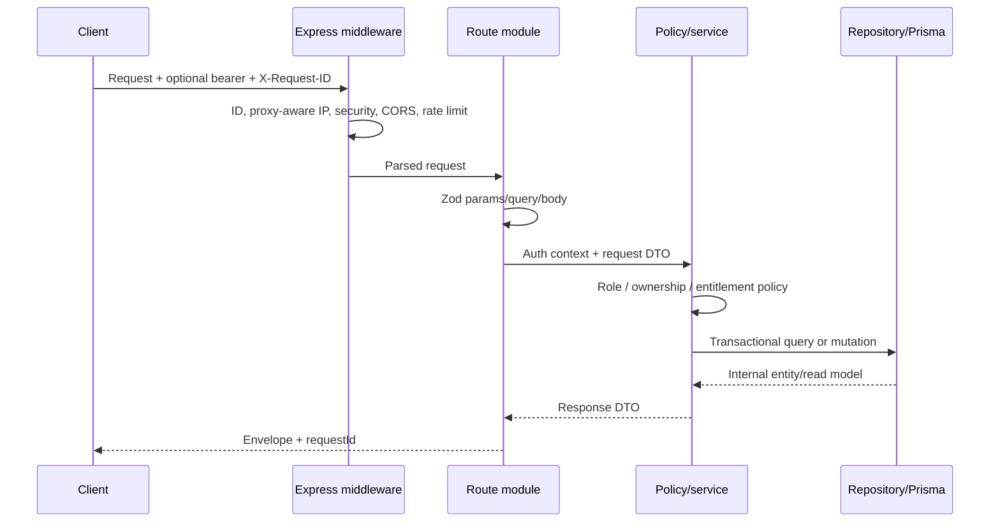

# Target system architecture

## Current system context — verified

## Target system context

## Target container architecture

## Architecture style and dependency rules

- Routes validate transport DTOs and call application services; they do not call Prisma or providers.
- Domain/application services enforce policy and transaction boundaries; they do not depend on Express or React.
- Repositories map Prisma records to internal entities/read models. Only owning modules write owned tables.
- Stripe, Cloudinary, email, logging, clocks, and ID generation are adapters behind narrow interfaces.
- Shared kernel is limited to error/envelope types, pagination, request context, policy primitives, clocks/IDs, and test factories. Business enums stay with owners.
- Admin and analytics compose public module queries; they cannot bypass module writes.
- No module imports a controller, route, or another module's repository.

## Request lifecycle

## Boundary decisions

| Boundary | Decision |
|---|---|
| Validation | Environment at startup; transport at routes; invariants in services; uniqueness/FKs in DB; provider payload after signature |
| Authorization | Backend named policies; frontend visibility only; ADMIN does not bypass billing records |
| Responses | Explicit DTOs; no raw Prisma, provider IDs, or premium stream URL in media detail |
| Observability | Request context crosses modules; provider/event logs at adapter boundary; redaction central |
| Background tasks | No queue initially. Fast synchronous webhook processing through ledger; daily Render cron/on-demand cleanup and reconciliation |
| Scaling | One web service is adequate; remove process-local correctness dependencies; add Redis only after measured need |

## Trade-off conclusion

Microservices and general event infrastructure are rejected: CineTube has one team, one deployment owner, one database, and no independently scaling workload. A modular monolith preserves atomic review/rating and payment-ledger writes while providing enough boundaries for safe incremental delivery.
