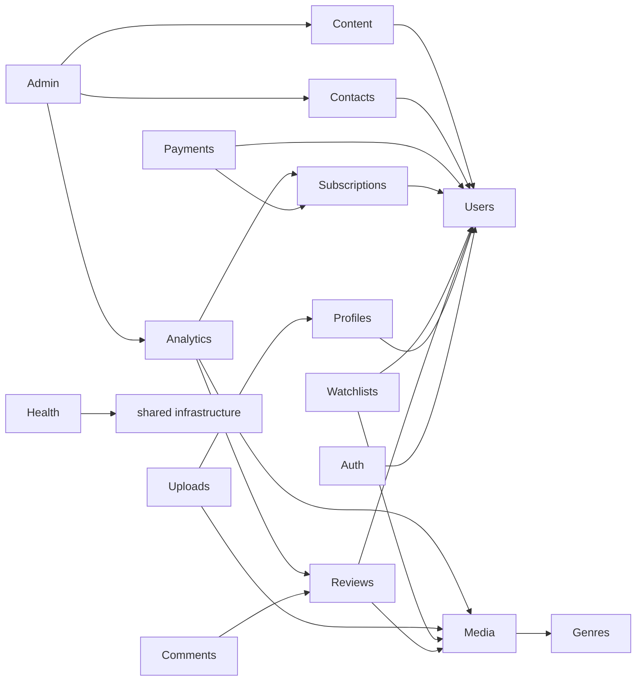
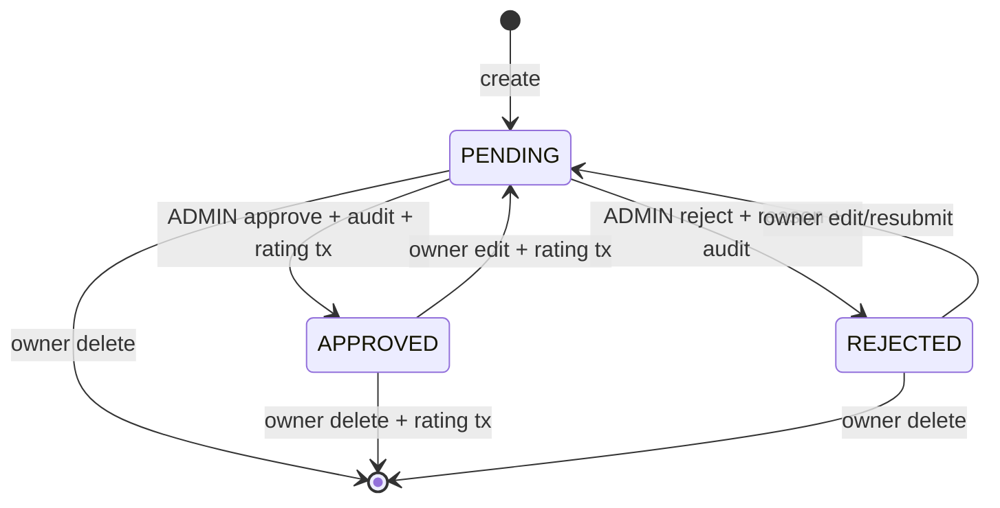

# Domain and backend module boundaries

## Modular backend map

Arrows mean “uses a public application/query API,” never “imports another module's Prisma repository.” Cycles are forbidden. `admin` and `analytics` are read/orchestration modules and own no core business writes.

## Module catalog — 16

| Module | Purpose and owned data | Routes/public services | Policy and validation | Allowed dependencies | Forbidden dependencies | Required tests |
|---|---|---|---|---|---|---|
| auth | Credentials, RefreshToken, PasswordResetToken | `/auth/*`; register/login/refresh/logout/session/reset | credential schemas, CSRF, session family, `sameActor` | users, email adapter | payment/media repositories | rotation/reuse/CSRF/reset/session limit |
| users | Account identity, role, soft-delete, lastActiveAt | admin user queries/status; `getUserSummary` | `manageUsers`, no self role escalation | auth policy primitives | content/payment provider | deletion/role/retention |
| profiles | UserProfile and profile-image reference | `/profile`, `/profile/image` | own-profile only; profile/image schemas | users, uploads public API | direct Cloudinary | CRUD/image ownership |
| media | Media, MediaViewDedup; listing/detail/stream/related | `/media/*`; media read/write API | `manageMedia`, entitlement on stream, filter/sort allowlist | genres, subscriptions policy, uploads public API | payment repository, raw provider | filters/stream/dedup/soft-delete |
| genres | Genre and MediaGenre association rules | `/media/genres`; genre lookup/assignment | admin mutation, normalized unique name | none | media service callbacks | uniqueness/assignment |
| reviews | Review, ReviewLike, ReviewReport, ModerationAction | `/reviews/*`, admin review/report APIs | owner/moderator/report policies | media/user summaries | profile/payment repositories | lifecycle/rating/report/audit |
| comments | Comment trees | nested comment routes | approved review, owner or admin delete, max depth 2 | reviews public API, user summary | media/payment repository | parent review/depth/delete |
| watchlists | Watchlist | `/watchlist`; user read model | actor-scoped IDs; UUID validation | media summaries | profiles/payment | duplicate/ownership/pagination |
| subscriptions | Current billing state and pure entitlement calculator | `/payments/subscription`; `getEntitlement` | actor/admin read; state transition map | users | Stripe SDK | full state table/time boundaries |
| payments | CheckoutAttempt, Transaction, PaymentAdjustment, ProcessedStripeEvent | checkout/confirm/cancel/resume/webhook/reconcile | actor, admin repair, idempotency schemas | subscriptions, users, Stripe adapter | media/review repositories | duplicates/order/refund/reconcile |
| uploads | Upload validation and asset lifecycle; no business tables | image upload/delete internal APIs | owner/folder/signature/size/dimension | Cloudinary adapter | arbitrary client public IDs | spoof/limits/replace/orphan |
| contacts | ContactSubmission | public create; admin list/detail/status | spam/rate limit; admin status | optional user summary, email adapter | auth token repository | validation/rate/status/retention |
| content | ContentPost; static legal/help content ownership | public blog; admin content CRUD | author/admin, slug/status schemas | user summary, uploads | payment/review repository | draft/publish/slug/public filters |
| analytics | Read models for user/admin metrics and charts | `/dashboard/overview`, `/admin/analytics` | self or admin; range/currency validation | module query APIs or reviewed read repository | business writes | metric definitions/ranges/currency |
| admin | Admin navigation/orchestration facade | `/admin/*` not owned elsewhere | ADMIN named capability | users/reviews/payments/contacts/content/analytics APIs | direct Prisma/provider | route denial/composition |
| health | Liveness, readiness, version | `/health`, `/ready` | public minimal output | Prisma ping/config/version | product data | ready failure/no-secret response |

## Shared kernel

Allowed: `ApiError`, envelope/pagination DTOs, request context, clocks/IDs, validation helpers, policy result, structured logger interface, transaction type, test builders. Forbidden: User/Media/Subscription business models, Stripe types, Cloudinary results, or “common services” that accumulate domain logic.

## Review and moderation state

- Only APPROVED reviews appear publicly and contribute to `averageRating`/`reviewsCount`.
- Approve/reject/edit/delete plus the required rating recomputation and moderation audit share one database transaction.
- An admin may remove any comment and moderate/reject a review, but cannot rewrite user-authored content.
- Report uniqueness is `(userId, reviewId)`; self-reporting is rejected; resolution/dismissal requires reason and audit.

## Cross-module internal events

Use direct in-process calls for required consistency. Lightweight after-commit notifications may be typed functions, not a broker: password changed → revoke sessions; review status changed → invalidate analytics; profile asset replaced → enqueue best-effort old-asset cleanup; payment state changed → recompute DTO/cache. Financial and rating correctness never depends on an in-memory event.
