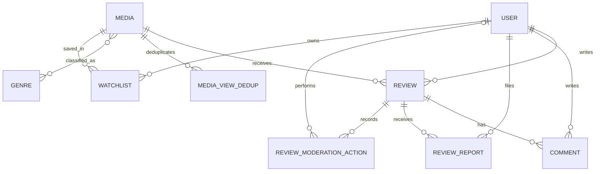
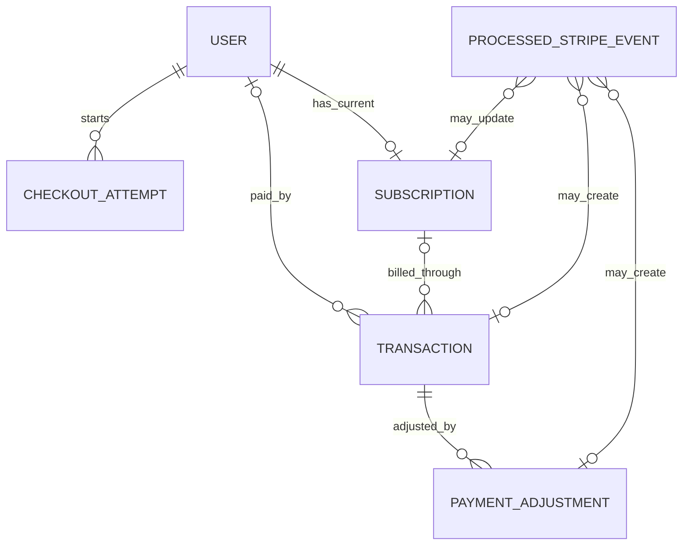
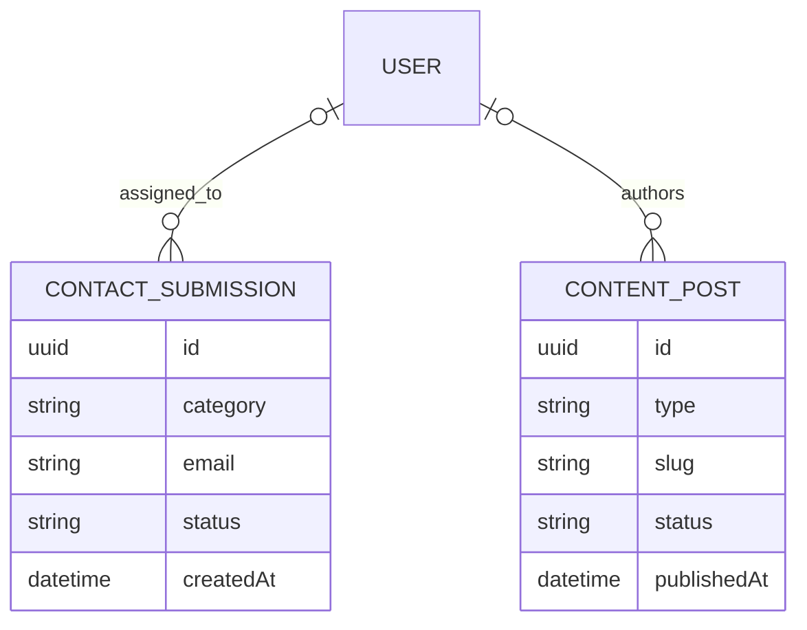
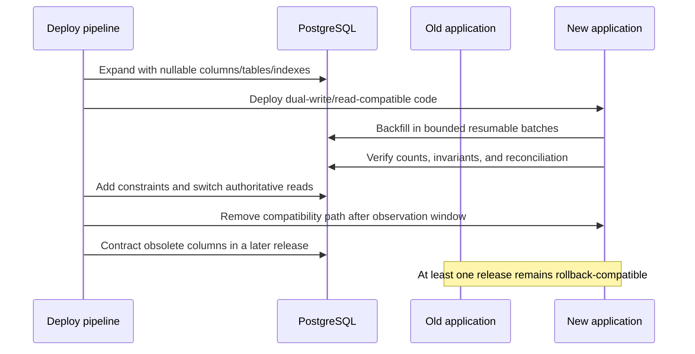

# 18. Target Data Model and Migration Strategy

## Purpose

The target model extends the existing Prisma/PostgreSQL design only where a production invariant cannot be expressed reliably in application memory. The changes below are proposals, not migrations. They preserve existing identifiers and relationships unless a staged compatibility change is explicitly described.

## Data ownership

| Data area | Owning module | Authoritative records | Important consumers |
|---|---|---|---|
| Identity and sessions | Auth | `User`, `RefreshToken`, `PasswordResetToken` | Profiles, authorization, audit |
| Catalog | Media | `Media`, `Genre`, media/genre relation | Home, browse, reviews, watchlists |
| Community | Reviews | `Review`, `ReviewReport`, `ReviewModerationAction`, `Comment` | Media ratings, admin moderation |
| Personal library | Watchlists | `Watchlist` | Profile and user dashboard |
| Billing | Payments and subscriptions | `CheckoutAttempt`, `ProcessedStripeEvent`, `Transaction`, `PaymentAdjustment`, `Subscription` | Entitlements, admin finance |
| Engagement | Analytics | existing views plus `MediaViewDedup` | Rankings and dashboards |
| Communications | Contacts | `ContactSubmission` | Admin inbox |
| Editorial content | Content | `ContentPost` | Public blog/help content |

## Proposed change register

Exactly **18 database changes** are proposed. The implementation roadmap must treat each row as a separately reviewable migration concern.

| ID | Change and purpose | Compatibility/backfill/default | Constraint and index intent | Rollback risk |
|---|---|---|---|---|
| DB-01 | Extend `RefreshToken` into a session record: `familyId`, `parentTokenId`, `lastUsedAt`, `revokedAt`, `revokedReason`, `ipHash`, `userAgent`, optional device label. Enables rotation reuse detection, current/all-session logout, and a five-session limit. | Add nullable columns; backfill each existing row into its own family; begin dual-read; require family fields only after old tokens expire. No synthetic IP or device values. | Unique token hash remains; indexes on `(userId, revokedAt, expiresAt)` and `familyId`; self-reference uses `SET NULL`. | Medium: contract only after the maximum refresh lifetime; rollback leaves harmless metadata. |
| DB-02 | Replace recoverable/reset token storage with `PasswordResetToken.tokenHash`, plus `usedAt` and `invalidatedAt`. | Create hash column, invalidate all legacy reset rows, and issue only newly hashed tokens. Never attempt to derive hashes from plaintext legacy values. | Unique hash; index `(userId, expiresAt)`; at most one usable token is enforced transactionally. | Low: invalidating legacy tokens requires users to request a new link. |
| DB-03 | Add `ProcessedStripeEvent` as the webhook event ledger with provider event ID, type, object ID, event time, payload hash, status, attempt count, lease, error class, and timestamps. | New table; no historical backfill is trusted. Reconciliation establishes current truth. | Unique provider event ID; indexes on status/lease and provider object/event time. Payload is not persisted unless explicitly encrypted and retention-approved. | Low for schema, high if removed after becoming the idempotency authority. |
| DB-04 | Add `CheckoutAttempt` to correlate a user, return path, price, Stripe checkout session, subscription, and terminal state without treating checkout as payment. | New checkouts write it; old Stripe objects are connected lazily by reconciliation when unambiguous. | Unique checkout session ID; index `(userId, createdAt)` and status/expiry. Return paths are stored only after same-origin sanitization. | Low. |
| DB-05 | Evolve `Transaction` into the canonical paid-invoice ledger: provider invoice ID, payment-intent ID, currency, amount in minor units, service-period bounds, paid timestamp, and immutable status transitions. | Add nullable fields; reconcile historical rows against Stripe; ambiguous duplicates go to a manual exception list. Dual-read old amount until verified, then contract. | Unique provider invoice ID; optional unique payment-intent ID when present; checks for non-negative minor amount and valid period. | High: financial history must never be deleted to roll back code. |
| DB-06 | Add immutable `PaymentAdjustment` for refunds/chargebacks with provider adjustment ID, transaction link, signed minor amount, reason, status, and provider timestamp. | New adjustments only; reconcile recent provider history before enabling admin totals. | Unique provider adjustment ID; index transaction/time; signed amount cannot be zero. | Low if readers ignore it; never reverse by deletion. |
| DB-07 | Expand `Subscription` billing lifecycle: provider customer/subscription IDs, billing status, cancellation intent/time, period bounds, grace end, revoked time/reason, price/product snapshots, and last provider event time. | Add nullable fields; populate from Stripe; use legacy status only until reconciliation passes. Free users have no fabricated active subscription. | Unique provider subscription ID; indexes on user/status/period end; event-time compare-and-set prevents older events from regressing state. | High: entitlement must continue to read the legacy path until parity is demonstrated. |
| DB-08 | Add `ReviewModerationAction` as an append-only audit record for submit, approve, reject, reopen, and report-resolution actions. | Seed a single `MIGRATED_STATE` entry for existing reviews if audit completeness is required; otherwise document the historical boundary. | Index review/time and actor/time; actor may be null only for migration/system actions. | Low. |
| DB-09 | Extend `ReviewReport` with resolution status, resolved timestamp, resolver, outcome note, and unique reporter/review protection. | Existing reports start `OPEN`; deduplicate exact reporter/review pairs deterministically before adding uniqueness. | Unique `(reviewId, reporterId)`; indexes status/created and review/status; resolver uses `SET NULL`. | Medium if historical duplicates exist. |
| DB-10 | Add `ContactSubmission` for public contact workflow: category, name, email, subject, message, status, assignee, resolution note, and timestamps. | New table; no backfill. Initial status `NEW`. | Index status/created; normalized email index only if lookup becomes necessary; length checks live in validation and DB where practical. | Low. |
| DB-11 | Add `ContentPost` for a deliberately small editorial surface: type, slug, title, excerpt, body, status, author, published time, SEO fields, and timestamps. | New table; initial content can be seeded through an explicit reviewed migration or admin workflow, not application startup. | Unique slug; indexes `(status, publishedAt)` and type/status; author uses `SET NULL`. | Low. |
| DB-12 | Add `User.imagePublicId` alongside the existing image URL so replacement and deletion can be ownership-safe. | Existing URLs remain valid with a null public ID; only newly managed images are deletable through the application. | Optional unique public ID; reject deletion when ownership metadata is absent. | Low. |
| DB-13 | Make `Transaction.userId` nullable with `ON DELETE SET NULL`, while adding immutable customer email/name snapshots. This retains legally relevant billing history after account deletion. | Snapshot current user values first, then change FK behavior. | Index nullable user/time; provider IDs remain the primary financial identity. | Medium; rollback cannot restore a deleted user relationship. |
| DB-14 | Add operational expiry indexes for refresh tokens, reset tokens, checkout attempts, webhook leases, and dedup buckets so bounded cleanup jobs avoid scans. | Concurrent/non-blocking index creation where supported; no data rewrite. | Partial indexes preferred for live/expired states after production query-plan verification. | Low, except temporary write load during creation. |
| DB-15 | Add verified read-path indexes for browse filters, moderation queues, user watchlists, and finance lists only after `EXPLAIN (ANALYZE, BUFFERS)` evidence. | Capture baseline plans and row counts; create one index per observed bottleneck. | Candidate composites: media publication/sort, review status/time, watchlist user/time, transaction paid time. Avoid speculative duplicates. | Low schema risk; index bloat is the main concern. |
| DB-16 | Add explicit media lifecycle fields `publicationStatus`, `publishedAt`, `archivedAt`, and `deletedAt` for draft/published/archive behavior without destructive deletes. | Existing visible media backfill to `PUBLISHED`; verify visibility counts before enabling filter. | Index status/published and partial live-media lookup; slug remains unique unless a future recycle policy is approved. | Medium: all public queries must include the live predicate before soft deletion is enabled. |
| DB-17 | Add `User.lastActiveAt` for coarse account/admin recency without storing a detailed surveillance log. | Initialize null; update at a throttled cadence, never on every request. | Index last-active only if an admin query needs it. | Low. |
| DB-18 | Add `MediaViewDedup` with media ID, daily bucket, HMAC viewer key, and expiry to provide durable approximate daily deduplication without Redis. | New views write both the dedup claim and aggregate increment transactionally; old aggregate counts remain intact. | Unique `(mediaId, bucketDate, viewerKey)`; expiry index; cascade from media. HMAC key is rotated under an explicit retention plan. | Medium: disabling it reverts to less accurate counts but must not decrement historical totals. |

## Media and review target relationships

Only `APPROVED` reviews contribute to the public rating aggregate. A moderation state transition and aggregate recomputation occur in one database transaction. `ReviewModerationAction` is append-only; it does not replace the current state on `Review`.

## Payment and entitlement target relationships

`CheckoutAttempt` proves intent, not settlement. A paid Stripe invoice is the canonical recurring-payment identity. Adjustments never overwrite the original transaction. The application derives entitlement from reconciled billing fields; it does not infer access merely from the presence of a subscription row.

## Contact and content target relationships

The content model is intentionally not a general CMS: no arbitrary components, revision graph, media library, or page builder is proposed. Legal/help pages may remain code-owned until editorial update frequency justifies a `ContentPost` record.

## Invariants and transaction boundaries

- Financial provider IDs are unique and immutable; money is stored as integer minor units plus ISO currency.
- A transaction cannot be created by `checkout.session.completed`; only a verified paid invoice can create the canonical payment row.
- Webhook ledger claim, domain mutation, and processed status are committed atomically where one database transaction can cover them.
- Subscription state uses provider event time and allowed transitions so delayed events cannot move state backwards.
- Entitlement reads one policy function, not raw subscription status checks scattered through controllers.
- Review moderation and media rating recalculation share a transaction and row-lock/serialization strategy.
- User deletion retains financial snapshots and anonymizes community content according to the approved retention policy.
- Cleanup jobs delete only expired operational data; finance and moderation audit records follow explicit retention rules.

## Migration execution pattern

Each production migration uses `prisma migrate deploy` as a pre-deploy step when the platform supports it; otherwise a separately gated CI migration job runs before application rollout. Application startup never runs schema-generating commands. Large backfills are resumable jobs with checkpoints, rate limits, dry-run counts, and a kill switch.

## Migration safety checklist

1. Record table size, lock risk, query plan, and expected duration.
2. Expand without changing current readers; avoid non-null columns with volatile table-wide defaults.
3. Deploy code able to tolerate both old and new representations.
4. Backfill deterministically in primary-key batches and report exceptions without silently coercing data.
5. Reconcile Stripe and rating aggregates before asserting constraints.
6. Add uniqueness only after duplicate reports are reviewed and resolved.
7. Observe error rate, replication lag, lock time, and application parity.
8. Contract in a separate release after the rollback window.

## Retention and privacy checkpoints

Before implementation, product/legal ownership must approve retention periods for refresh-session metadata, reset records, contact messages, Stripe event metadata, finance records, moderation audit, and daily viewer HMACs. Logs must not contain access tokens, cookies, reset tokens, Stripe secrets, full webhook payloads, contact messages, or raw viewer fingerprints.

## Deliberately rejected schema expansion

- Redis is not required for the assignment-scale view counter; DB uniqueness is sufficient and operationally simpler.
- A generic `UserActivity` event warehouse is not proposed; dashboard data is derived from domain tables plus coarse `lastActiveAt`.
- A general-purpose CMS, notification center, recommendation-training store, and multi-role ACL schema are deferred until a verified requirement exists.
- No enum or table rename is proposed merely to make naming more fashionable; compatibility and marking risk take precedence.
