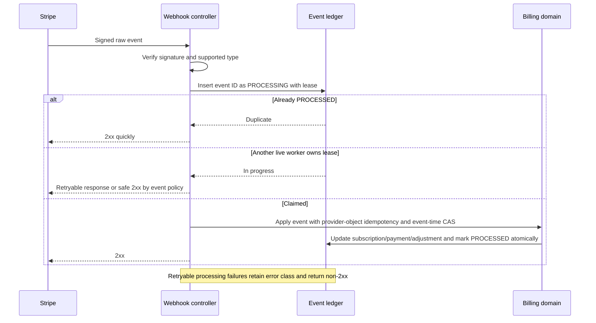
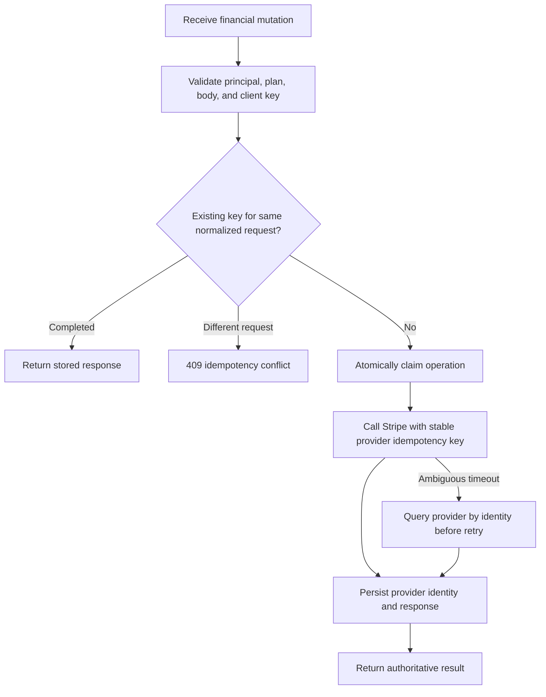
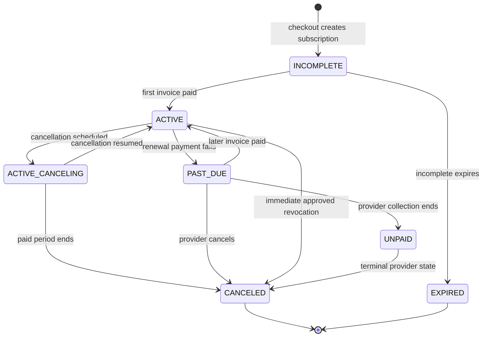
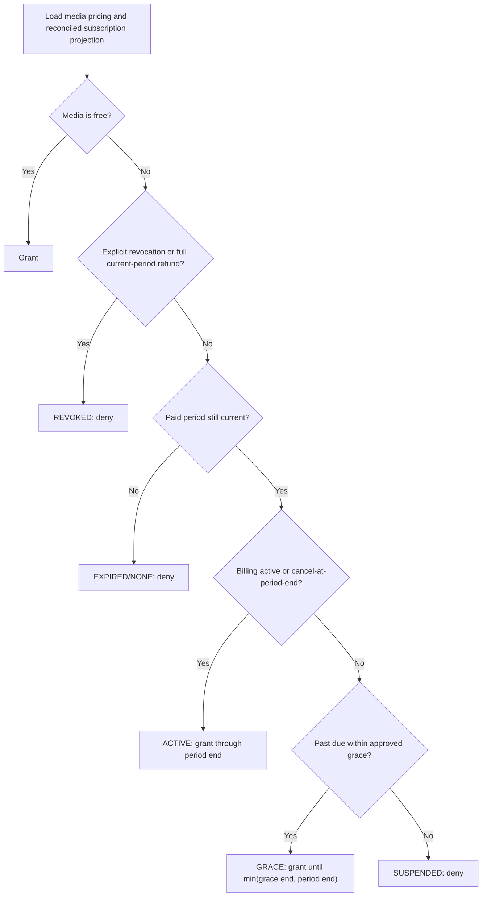

# 21. Payment and Subscription Reliability Architecture

## Reliability objective

Stripe is the external billing authority; PostgreSQL is the application's durable, queryable projection. The target makes checkout intent, paid invoices, refunds, webhook delivery, subscription lifecycle, and media entitlement separate concepts. This removes double-counting and prevents a redirect or out-of-order webhook from granting or revoking access incorrectly.

## Canonical identities

| Concern | Canonical identity | Rule |
|---|---|---|
| Checkout intent | Stripe checkout session ID | Correlates user, plan, and sanitized return path; never proves payment. |
| Recurring payment | Stripe invoice ID | Exactly one `Transaction` per paid invoice. |
| Provider payment execution | Payment intent ID when present | Secondary unique correlation, not a replacement for invoice identity. |
| Refund/chargeback | Provider refund/adjustment ID | Immutable `PaymentAdjustment`; original transaction remains unchanged. |
| Subscription | Stripe subscription ID | Exactly one current provider projection; event-time ordering applied. |
| Delivery attempt | Stripe event ID | Exactly one event-ledger row; duplicates safely acknowledge. |
| Client retry | Server idempotency record + Stripe idempotency key | Same principal/operation/body returns the first result; changed body conflicts. |

Money is stored as integer minor units with ISO currency. Provider-created timestamps and service periods are stored separately from application receipt time.

## Checkout lifecycle and return path

```mermaid
sequenceDiagram
    actor U as User
    participant W as Web app
    participant P as Payment API
    participant DB as PostgreSQL
    participant S as Stripe
    U->>W: Start subscription or premium unlock from current page
    W->>P: Create checkout(plan, sanitized relative returnPath, idempotency key)
    P->>DB: Create/claim CheckoutAttempt
    P->>S: Create checkout session with stable Stripe idempotency key
    S-->>P: Session ID and hosted URL
    P->>DB: Save provider session ID
    P-->>W: Hosted URL
    W->>S: Redirect to checkout
    S-->>W: Redirect to fixed callback with session ID
    W->>P: Fetch owned checkout outcome
    P-->>W: Pending/paid/failed derived state
    W->>W: Return to the original sanitized page and refresh entitlement
    Note over W,P: Redirect parameters never grant access; webhook/reconciliation does
```

The return path is a relative path selected from the page that initiated checkout (profile for subscription management, media detail for unlock flows). The server rejects absolute URLs, scheme-relative URLs, encoded bypasses, and non-allowlisted application routes. Stripe success/cancel URLs point to a fixed application callback; the callback resolves the stored path after verifying attempt ownership.

## Webhook ingestion and ordering



The handler acknowledges verified unsupported event types with 2xx after recording minimal diagnostics. Signature/payload errors return 400. Transient database/provider failures return a retryable non-2xx. Permanent domain exceptions move to a reviewed dead-letter state only after bounded attempts; they are visible to reconciliation and alerts. A stale processing lease can be reclaimed safely.

Stripe documents that webhook endpoints can receive retries, duplicate events, and events out of order, and recommends returning a successful response quickly. The design therefore uses both [event delivery safeguards](https://docs.stripe.com/webhooks) and domain-object uniqueness rather than assuming one ordered delivery.

## Payment idempotency



Stripe recommends idempotency keys on POST requests; the server, not the browser, derives the provider key from the durable operation identity ([Stripe idempotent requests](https://docs.stripe.com/api/idempotent_requests?lang=curl)). Network ambiguity is resolved by provider lookup and reconciliation rather than blindly creating another object.

## Subscription billing state



Billing state mirrors provider facts. `ACTIVE_CANCELING` is an application presentation of active billing plus `cancelAtPeriodEnd=true`, not premature cancellation. Paid invoices create transactions; Stripe's subscription invoice lifecycle is treated as the recurring billing source ([subscription invoices](https://docs.stripe.com/billing/invoices/subscription)). Older events may fill missing metadata but cannot regress the latest lifecycle state.

## Derived entitlement state



Proposed product policy: a past-due subscriber receives a 72-hour grace period, never beyond the already recorded service-period end. This is a human approval checkpoint. A full refund covering the current service period revokes access; a partial refund records an adjustment but does not automatically revoke. Dispute policy is also a product/legal checkpoint.

Entitlement states are `NONE`, `ACTIVE`, `GRACE`, `SUSPENDED`, `EXPIRED`, and `REVOKED`. They are derived at read time from billing projection fields and policy settings, not stored as an independently mutable truth.

## Reconciliation workflow

```mermaid
sequenceDiagram
    participant J as Scheduled/on-demand job
    participant S as Stripe API
    participant DB as Local billing projection
    participant A as Admin reviewer
    J->>S: Fetch bounded subscriptions, invoices, refunds, events
    J->>DB: Compare provider identities, amounts, periods, and statuses
    J->>DB: Store dry-run discrepancy report
    alt Safe deterministic metadata gap
        J->>DB: Propose bounded repair
    else Ambiguous financial mismatch
        J->>DB: Mark manual review; do not mutate
    end
    A->>DB: Review evidence and approve named repair
    DB->>DB: Apply compare-and-set repair with immutable audit
    J->>S: Re-read repaired object
    J->>DB: Verify or reopen discrepancy
```

The job runs daily and on demand over a bounded window, with cursors and rate limits. Default mode is dry-run. Automatic repair is limited to explicitly allowlisted, reversible metadata gaps; it never deletes transactions or invents payments. Any entitlement-affecting or amount mismatch requires human approval. Reports include provider/local values, proposed action, confidence, and request/job IDs with secrets redacted.

## Refund behavior

- A refund creates/updates an adjustment by provider refund ID; it does not mutate the paid amount into historical fiction.
- Aggregate net revenue equals paid transaction minor amounts plus signed successful adjustments, grouped by currency.
- Multiple partial refunds are supported and cannot exceed provider-confirmed refunded total.
- A full current-period refund triggers explicit entitlement reevaluation and an audited revocation decision.
- Failed/pending refunds are visible but excluded from successful net totals until provider-confirmed.
- Account deletion retains anonymized financial records and provider identities according to retention policy.

## Failure handling matrix

| Failure | User/API behavior | Recovery | Alert threshold |
|---|---|---|---|
| Checkout create times out | Return retryable error with same operation reference | Provider lookup, then same-key retry | Elevated error ratio over 5 minutes |
| Redirect occurs before webhook | Show pending state and original return page | Poll bounded outcome; webhook/reconciliation establishes truth | Pending beyond expected window |
| Duplicate webhook | 2xx with no repeated domain mutation | Event and object uniqueness | Sudden duplicate-rate spike only |
| Out-of-order subscription event | Do not regress newer state | Event-time compare-and-set; reconciliation | Any rejected state regression count |
| Database unavailable | Webhook returns retryable failure | Stripe retry plus readiness failure | Immediate sustained DB failure |
| Poison event | Bounded retries, then reviewed dead letter | Manual diagnosis/replay after code/data fix | First dead-letter financial event |
| Provider API unavailable | Do not guess or revoke on absence | Retry with backoff; reconciliation | Provider error budget breach |
| Reconciliation mismatch | No destructive automatic repair | Dry-run report and approval workflow | Any amount/currency mismatch |

## Observability

Metrics:

- checkout attempts/completions/abandonment by plan, without user email labels;
- webhook verified, duplicate, processing duration, retries, failures, stale leases, and dead letters by event type;
- invoice-created transaction conflicts and refund adjustment conflicts;
- subscription state transition counts and rejected stale transitions;
- entitlement decisions by reason code (bounded labels);
- reconciliation objects scanned, discrepancies by class, repair outcomes, and oldest unresolved age.

Structured logs correlate request ID, event ID, checkout attempt ID, provider object suffix, and user UUID only where required. No full payload, card data, secret, cookie, or contact data is logged. Alerts link to a runbook covering provider dashboard verification, local ledger inspection, safe replay, and reconciliation.

## Acceptance invariants

1. Replaying the same event or client request cannot create a second transaction, refund, checkout session, or subscription mutation.
2. `checkout.session.completed` never creates revenue or alone grants entitlement.
3. Every successful paid invoice appears once in transaction history, including renewals.
4. Cancel-at-period-end retains access through the paid period.
5. Delayed events cannot regress subscription state.
6. Net revenue accounts for successful adjustments without rewriting paid history.
7. The UI returns to its stored initiating page and confirms state through the API.
8. Reconciliation defaults to dry-run, is bounded, audited, and never deletes financial history.

