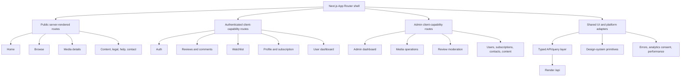

# 22. Frontend Design System and Page Architecture

## Product experience objective

Evolve the existing Next.js/shadcn interface into a coherent movie portal without replacing the stack or producing a generic dashboard template. Public discovery remains fast and cinematic; member workflows are calm and predictable; administration prioritizes dense, auditable operations. Every page owns loading, empty, error, unauthorized, and success states.

## Frontend feature architecture

Public read-heavy pages use server components where data is truly public and cacheable. Protected pages remain client-capability driven because the browser-held cross-origin refresh cookie is not available to the Vercel Next.js server as a reliable Render API session. The client restores a session once, holds the access token only in memory, and gates protected UI on `user && accessToken`.

## Seventeen feature boundaries

| # | Boundary | Owned routes and concerns | Main query/mutation contract |
|---:|---|---|---|
| 1 | `auth` | Login, register, forgot/reset, session restore | `/auth/*`; session state and redirect sanitization |
| 2 | `home` | Landing composition | `/home`; section DTOs |
| 3 | `browse` | Search, filters, sorting, pagination | `/media` |
| 4 | `media-details` | Detail, related, trailer/stream gate | `/media/:id`, `/related`, `/stream`, `/view` |
| 5 | `reviews` | Public list, create/edit/delete, own list | `/reviews/*` |
| 6 | `comments` | Review discussion CRUD | review comment endpoints |
| 7 | `watchlist` | Personal saved media | `/watchlist` |
| 8 | `profile` | Identity fields, profile image, password | `/profile`, `/auth/password` |
| 9 | `subscription` | Plans, checkout result, manage/cancel/resume | `/payment/*` |
| 10 | `user-dashboard` | Personal overview and activity summaries | `/dashboard/overview` |
| 11 | `admin-dashboard` | Operational metrics and charts | `/admin/dashboard`, `/admin/analytics` |
| 12 | `admin-media` | Catalog CRUD, publication, asset workflow | Admin-protected media endpoints |
| 13 | `admin-reviews` | Review/report queues and audit | `/admin/reviews`, `/admin/review-reports` |
| 14 | `content` | Blog/help listing/detail and editorial admin | `/content/posts`, `/admin/content/posts` |
| 15 | `contact` | Public submission and admin inbox | `/contacts`, `/admin/contacts` |
| 16 | `legal` | Privacy, terms, accessibility statement | Code-owned static routes initially |
| 17 | `shared-ui` | App shell, primitives, forms, charts, states | No domain fetches; typed composition only |

Feature folders may import `shared-ui`, API/query primitives, and their own public types. A feature cannot reach into another feature's private components or query keys; cross-feature composition happens at route level or through an intentionally exported facade.

## Information architecture and route ownership

| Route | Audience | Owner | Rendering/auth behavior | Primary outcome |
|---|---|---|---|---|
| `/` | Public | Home | Server-rendered public data; revalidated cache | Discover notable content and start browsing |
| `/browse` | Public | Browse | URL-owned filters; server first result, client transitions | Search/filter catalog with shareable state |
| `/media/[id-or-slug]` | Public/member | Media details | Public detail SSR; client entitlement/review enhancement | Understand title, participate, or watch |
| `/login`, `/register` | Guest | Auth | Client form; redirect to sanitized prior route | Establish session capability |
| `/forgot-password`, `/reset-password` | Guest | Auth | Non-enumerating forms | Recover account securely |
| `/dashboard` | Member | User dashboard | Capability gate + private queries | See saved content, review states, recent activity |
| `/watchlist` | Member | Watchlist | Capability gate | Manage saved media |
| `/profile` | Member | Profile/subscription | Capability gate | Edit profile, security, sessions, billing |
| `/checkout/result` | Member | Subscription | Fixed callback, verifies owned attempt | Explain pending/success and return to origin |
| `/blog`, `/blog/[slug]` | Public | Content | Cacheable published content | Read editorial content |
| `/contact` | Public | Contact | Server shell + protected mutation | Submit a bounded support/contact request |
| `/help`, `/privacy`, `/terms`, `/accessibility` | Public | Legal/content | Static or published content | Policy and support clarity |
| `/admin` | Admin | Admin dashboard | Admin capability gate | Operational overview |
| `/admin/media/*` | Admin | Admin media | Admin gate; guarded forms | Create/edit/publish/archive catalog |
| `/admin/reviews` | Admin | Admin reviews | Admin gate; URL queue filters | Moderate reviews and reports |
| `/admin/users` | Admin | Admin operations | Admin gate | Inspect/suspend/reactivate accounts |
| `/admin/subscriptions` | Admin | Admin operations | Admin gate | Inspect billing projection/reconciliation |
| `/admin/contacts` | Admin | Contact | Admin gate | Assign and resolve contact requests |
| `/admin/content` | Admin | Content | Admin gate | Draft/publish/archive editorial posts |

Unknown protected state shows an auth-check skeleton, not a flash of protected content or a redirect loop. A confirmed 401 clears capability and attempts one single-flight refresh only when appropriate; 403 renders an access-denied state distinct from login.

## Visual system

### Brand and color

Use two brand colors only: a restrained cinema red for primary action/selection and warm amber for rating/emphasis. Neutrals carry almost all surfaces and text. Semantic success, warning, destructive, and information colors are tokens—not extra brand colors.

| Token group | Light intent | Dark intent | Constraint |
|---|---|---|---|
| Background/surface | Warm-neutral page, white/elevated panels | Near-black page, charcoal panels | Maintain visible surface hierarchy without gradients everywhere |
| Primary | Deep red with white text | Lighter red with dark/high-contrast text as measured | Reserved for decisive action and active navigation |
| Accent/rating | Dark amber | Bright amber | Ratings, premium marker, small highlights; not body text on white |
| Text | Near-black, muted slate | Off-white, cool muted gray | WCAG contrast verified in both themes |
| Border/focus | Neutral border, high-contrast red/blue focus token | Lighter neutral, high-contrast focus token | Focus ring must not depend on brand fill |

Theme choices are `light`, `dark`, and `system`, persisted in a small non-sensitive cookie or local preference. The root theme attribute is resolved before paint with a hydration-safe mechanism; the control has an accessible label and never renders a different initial icon server/client. A CSP-compatible implementation is required before enforcing CSP.

### Spacing, type, radius, and motion

- Base spacing unit: 4px; common rhythm 8/12/16/24/32/48/64.
- Base radius: 10px; small controls 8px, large feature panels 14px. Avoid unrelated pill shapes.
- Content width: 1280px maximum for discovery pages, narrower readable measure for articles/forms.
- Typography: one existing performant sans family; display scale uses weight/spacing rather than multiple novelty fonts.
- Motion duration: 120–220ms for state feedback; respect `prefers-reduced-motion`; no auto-advancing carousels without pause controls.

### Primitive strategy

Keep shadcn/Radix primitives as the accessibility and interaction base: button, input, textarea, label, select, checkbox, radio group, dialog, alert dialog, dropdown, popover, tooltip, tabs, toast, table, pagination, sheet, command/search, skeleton, badge, card, avatar, and chart wrapper. Recharts is used through the shadcn chart composition documented in the [shadcn chart component](https://ui.shadcn.com/docs/components/base/chart). Feature components compose primitives and tokens; they do not fork primitive keyboard behavior.

## Shared component inventory

| Component | Responsibility |
|---|---|
| `AppHeader`, `MobileNav`, `Footer` | Stable navigation, theme control, auth-aware actions, legal/support links |
| `PageHeader`, `SectionHeader` | Consistent title, description, action, breadcrumb hierarchy |
| `MediaCard`, `MediaRail`, `MediaGrid` | One responsive media summary language with image fallback and rating label |
| `SearchField`, `FilterBar`, `SortSelect`, `ActiveFilterChips` | URL-synchronized, keyboard-operable browse controls |
| `DataTable`, `TableToolbar`, `ResponsiveRecordList` | Admin desktop density with intentional mobile representation |
| `FormField`, `PasswordField`, `ImageField`, `FormActions` | Label/help/error association and pending protection |
| `LoadingState`, `SkeletonSet`, `EmptyState`, `ErrorState`, `AccessDenied` | Deliberate state grammar and retry behavior |
| `ConfirmDialog`, `StateBadge`, `AuditTimeline` | Safe destructive/admin workflows and state history |
| `StatCard`, `ChartCard`, `ChartLegend`, `DateRangeControl` | Defined metrics with textual alternatives |
| `EntitlementGate`, `PlanCard`, `SubscriptionStatus` | Explain free/premium/access/cancel/grace behavior without exposing stream URL |
| `ReviewCard`, `ReviewEditor`, `ModerationPanel`, `ReportDialog` | Review/community lifecycle with visible status |

## Home page composition

The home page has **eight purposeful sections**, each independently removable when empty so the design does not manufacture content.

| Section | Purpose and data | Endpoint/state | Interaction and accessibility |
|---|---|---|---|
| 1. Hero spotlight | One editorially selected or deterministic high-quality published title | `/home`; image fallback and compact error fallback | One clear details CTA; optional trailer never autoplay with sound; meaningful image alt |
| 2. Continue exploring | Recently viewed for a restored member; otherwise omitted | Client enhancement from dashboard/home personalized contract | Private/no-store; keyboard rail; explains sign-in only when useful |
| 3. Trending now | Recent view momentum with minimum sample threshold | `/home`; skeleton rail, empty omitted | Ordered label is not conveyed by color alone; cards are links |
| 4. Top rated | Approved-rating ranking with vote-count threshold | `/home`; stable cached rail | Rating includes visible numeric value and vote context |
| 5. New releases | Recently published/released catalog | `/home`; responsive grid/rail | Date semantics in text; no infinite carousel |
| 6. Free to watch | Direct path to no-subscription value | `/home` | Pricing badge has text; stream CTA still checks capability |
| 7. Premium picks | Explain premium catalog and plan value | `/home` + `/payment/plans` | CTA preserves current return path; no manipulative urgency |
| 8. Browse by genre | Compact genre navigation | `/media/genres` | Real links with counts only if definitions are trustworthy |

## Browse and media detail behavior

Browse filters live in the URL, use an explicit Apply action on small screens, and announce result-count changes through a polite live region. Reset removes only browse parameters. Empty results explain active constraints and offer a clear reset. Pagination remains stable and linkable; image loading uses responsive sizes and bounded aspect-ratio placeholders.

Media detail hierarchy:

1. Poster/backdrop, title, release/type/runtime, genres, rating with vote count, and pricing label.
2. Primary action determined by entitlement: watch, subscribe/unlock, or sign in; unavailable reasons are explicit.
3. Synopsis and metadata with readable line length.
4. Trailer/media area with consent-aware embeds and accessible title.
5. Review summary and approved reviews; member editor reflects pending/approved/rejected state.
6. Related media rail.

View recording is best-effort after a meaningful detail engagement, deduplicated server-side. It must not block content render or fire repeatedly on every re-render.

## Forms and feedback

Forms use React Hook Form-compatible Zod schemas mirrored by server validation without pretending client validation is authoritative. Errors sit beside their fields and a summary receives focus on failed submission. Pending submission disables only unsafe repetition, preserves entered values, and uses text plus spinner. Success feedback is durable enough to perceive and updates the canonical query cache. Destructive actions require a focused confirmation dialog describing the object and impact.

Profile includes identity fields, owned image replace/remove, password change, live session list/revocation, and subscription state. Reset, login, and contact messages avoid account or internal-data disclosure. Admin forms surface optimistic conflicts and allow the operator to reload rather than overwrite silently.

## User dashboard

The member dashboard prioritizes action over vanity statistics:

- watchlist preview and count;
- own reviews grouped by pending/approved/rejected with rejection reason where safe;
- recent views with a privacy/retention explanation;
- current plan, entitlement, cancellation intent, grace/period end, and manage action;
- account/security shortcuts.

No chart is required unless it answers a real member question. Empty accounts receive a browse CTA, not a panel full of zero-value graphs.

## Admin dashboard and operations

Metric definitions are server-owned and time-bounded:

| Metric/chart | Definition | Visualization | Safeguard |
|---|---|---|---|
| Active users | Distinct users with coarse activity in selected period | Stat + line | Never label total registered users as active |
| Published catalog | Live media count by type/pricing | Stats + stacked bar | Excludes archived/deleted |
| Review queue | Pending reviews and open reports; oldest age | Stats + trend | Queue age has alert threshold |
| Subscription projection | Derived active/grace/suspended/canceling counts | Stats + bar | Labels distinguish billing vs entitlement |
| Gross/refunds/net | Successful paid minor amounts and adjustments by currency | Line/bar; currency-separated | Never sum different currencies |
| Checkout conversion | Completed attempts / created attempts by plan | Funnel-style bars | Clearly states attribution window |
| Top media | Views and approved rating with sample thresholds | Ranked table | Shows definitions and time range |
| Webhook/reconciliation health | Failures, stale events, unresolved discrepancies | Operational cards/table | Links to runbook, not user PII |

Every chart includes a title, definition, time range, units, keyboard-accessible tooltip behavior where practical, and a table/text alternative. Color is not the sole series distinction. Admin navigation groups Overview, Catalog, Community, Users, Billing, Contacts, and Content; mobile uses a sheet, while desktop uses a persistent rail.

## Data and cache behavior

TanStack Query remains the client data authority for protected data. Each feature exports query-key factories and typed adapters. Public server queries avoid immediate duplicate client fetching. Mutations update/invalidate the narrow authoritative keys; logout and failed session restoration remove all user-scoped queries. Retry policy excludes validation, authorization, and deterministic conflicts and bounds transient retries with jitter.

Search input uses debounce plus cancellation; filters do not create request storms. Prefetch is limited to likely navigation and respects data-saving signals where available. No cache entry containing one user's data can survive into another login.

## Responsive, accessibility, and performance requirements

- Target widths are content-driven, with explicit QA at 320, 375, 768, 1024, and 1440px and at 200% zoom.
- Touch targets are at least 44px where practical; tables become designed cards or retain labeled horizontal scroll, never clipped controls.
- One `h1`, ordered headings, landmarks, skip link, visible focus, dialog focus return, Escape behavior, and full keyboard completion are required.
- Images have dimensions/aspect ratios to prevent layout shift; decorative backdrops use empty alt while posters use useful title/context.
- Route-level JS is kept feature-local; charts/editors load only on routes that use them. Bundle budgets are CI warnings first, then gates after baseline.
- Target Core Web Vitals at the 75th percentile: LCP ≤2.5s, INP ≤200ms, CLS ≤0.1 on supported production telemetry, with lab budgets as early signals.
- Errors are captured at route and component boundaries with a request ID and useful recovery action; sensitive details remain server-side.

## Deliberate exclusions

No visual page builder, social feed, real-time chat, uncontrolled infinite scroll, auto-playing hero carousel, heavy animation system, client-side auth persistence, or frontend-local billing truth is part of this upgrade. These would add marking and operational risk without satisfying the stated product requirements.
