# 23. Testing and Quality-Gate Strategy

## Quality objective

Create a small, deterministic test pyramid around the behaviors that can lose access, money, data, or marks. The current repository has no meaningful automated test safety net, so the first implementation phase establishes tooling and a thin critical-path suite before structural refactors. Tests never call live Stripe, Cloudinary, or email services.

## Tooling decision

| Layer | Proposed tool | Why it fits |
|---|---|---|
| Backend unit/integration | Vitest + Supertest | TypeScript-friendly, fast service tests and real Express request contracts |
| Frontend unit/component | Vitest + React Testing Library + user-event | Behavior and accessibility-oriented React verification |
| End-to-end | Playwright | Cross-browser routing, responsive, session, and form workflows |
| API schema | Zod/OpenAPI generation + breaking-change diff | Keeps runtime validation and published contract aligned |
| Accessibility | axe integration plus manual keyboard/screen-reader checks | Automated detection plus human interaction coverage |
| Database | Disposable PostgreSQL schema/database | Exercises Prisma constraints and transactions instead of mocking them away |

Use the package manager and test runner versions already compatible with Node 20 and the repo. Dependency introduction occurs in a dedicated implementation commit and must not require production runtime packages where dev dependencies suffice.

## Test pyramid

| Layer | Scope | Representative cases | Execution |
|---|---|---|---|
| Pure unit | Policies, DTO mappers, validation, state transitions, sanitizers | Return-path rejection, entitlement decisions, sort allowlist, money math, event ordering | Every PR, fast |
| Service integration | Prisma transactions and provider ports | Refresh reuse, review aggregate transaction, paid-invoice uniqueness, refund ledger, view dedup | Every PR against disposable DB |
| HTTP integration | Express middleware/controller/DTO | Origin/CSRF, auth/role/ownership, error envelope, upload limits, webhook signature/raw body | Every PR |
| Component | Forms, states, tables, dialogs, charts | Error focus, keyboard filter, protected-state skeleton, chart fallback, responsive nav | Every PR |
| End-to-end | Only critical multi-page journeys | Login/restore/logout, reset capture, review moderation, checkout mock return, admin workflows | PR smoke; fuller scheduled run |
| Production smoke | Read-only/minimal-safe checks after deploy | Liveness/readiness, public home/browse/detail, login page, API contract header | Deployment gate/monitor |

## Critical coverage matrix

| Risk | Required automated evidence |
|---|---|
| Auth capability drift | `isAuthenticated` false when either user or memory token is missing; single-flight restore; logout clears private cache |
| Refresh theft/race | Concurrent consume creates one successor; replay revokes family; expired/revoked/suspended cases |
| Password recovery | Generic forgot response, hash-only persistence, single use/expiry, all-session revocation, mail adapter called without logs |
| CSRF/CORS | Exact allowed origin passes; lookalike/missing/mismatch fail; webhook signature route remains functional |
| Authorization | USER/ADMIN capability table plus ownership cases for reviews, comments, watchlists, sessions, profile, billing |
| Premium access | Free, active, canceling, grace boundary, suspended, expired, revoked, full/partial refund cases |
| Stripe duplicates/order | Replayed event is no-op 2xx; two event IDs for one invoice yield one transaction; stale state event cannot regress |
| Checkout identity | Redirect alone does not grant; return path is sanitized and restored; client/provider idempotency behavior |
| Reconciliation | Dry-run produces discrepancies; no automatic destructive repair; approved compare-and-set repair audited |
| Review moderation | Only approved affects rating; approve/reject/edit/delete recompute atomically; action audit recorded |
| Upload safety | Spoofed MIME, excessive dimensions/bytes, wrong folder/owner, arbitrary public ID deletion all fail |
| API contracts | 42 compatibility endpoints plus additions conform to response/error DTO; pagination max 50 |
| UI completeness | Loading/empty/error/access-denied/success states and form focus behavior for core routes |
| Accessibility | axe baseline, keyboard journeys, focus dialogs/nav, zoom/mobile layout, chart text alternative |
| Deployment | Migration compatibility, readiness DB failure, graceful shutdown, rollback-compatible schema |

## Provider test doubles

Provider code is behind narrow ports:

- `BillingProvider`: create/retrieve checkout, cancel/resume subscription, list reconciliation objects.
- `AssetProvider`: upload, inspect, delete an owned stored asset.
- `EmailProvider`: deliver reset/contact operational mail.

Unit tests use in-memory fakes with deterministic IDs and clocks. HTTP integration uses signed stored Stripe fixture payloads, not the live API. A fixture includes its provider API version and event creation time. Contract tests verify outbound request shape against the adapter but do not claim to replace provider sandbox smoke testing. Sandbox testing is an explicitly manual/pre-release step with test keys only.

## Database and migration tests

- Apply all migrations to an empty disposable PostgreSQL database.
- Apply from a representative pre-upgrade snapshot and run each backfill twice to prove resumability/idempotency.
- Verify uniqueness for invoice, refund, event, review report, and daily view identities under concurrency.
- Prove old and new application readers tolerate the expand/dual-read releases used for rollback.
- Verify foreign-key behavior for user deletion retains finance snapshots and handles moderation actors.
- Run reconciliation/rating invariant queries after backfill and fail on unexplained exceptions.

Migration tests use sanitized generated fixtures, never a copied production database in CI.

## CI quality-gate sequence

```mermaid
flowchart LR
    A["PR opened"] --> B["Install with lockfile"]
    B --> C["Secret and dependency audit"]
    C --> D["Format check"]
    D --> E["Lint"]
    E --> F["Typecheck frontend + backend"]
    F --> G["Unit/component tests"]
    G --> H["PostgreSQL migration + integration tests"]
    H --> I["Production builds"]
    I --> J["Playwright critical smoke"]
    J --> K["OpenAPI breaking-change check"]
    K --> L["Artifact and deploy eligibility"]
```

No later gate compensates for an earlier failure. Independent frontend/backend unit jobs may run in parallel after install, but deployment eligibility waits for all required checks.

## Required gates

| Gate | Initial policy | Mature policy |
|---|---|---|
| Lockfile install | Required; immutable install | Required |
| Formatting/lint | Required, with existing debt baselined explicitly | Zero new warnings; then ratchet to zero warnings |
| Typecheck | Required both packages | Required |
| Unit/integration | Critical-path suite required | Required plus coverage thresholds by risk area |
| Coverage | Report only while tests are seeded | Branch ≥80% for auth/payment/policy modules; no global vanity target |
| Build | Production frontend/backend builds required | Required |
| E2E | Critical smoke required | Required critical plus scheduled broader matrix |
| Accessibility | axe on core components/routes | Required automated baseline plus release checklist |
| Dependency/secret scan | High/critical findings block after triage policy | Required |
| API diff | Breaking changes require explicit approval/deprecation plan | Required |

Flaky tests are defects: quarantine requires an owner, issue, and expiry; a retry cannot turn a consistently failing test green. Tests freeze clocks and IDs and avoid arbitrary sleeps.

## End-to-end journeys

1. Guest browses, filters with a shareable URL, opens media, and sees an accurate free/premium action.
2. User registers/logs in, refreshes after access expiry, reloads successfully, logs out, and sees no cached private data.
3. User requests a reset through captured test mail, resets once, and old sessions cannot restore.
4. User creates/edits a review; admin approves/rejects; public rating and audit change correctly.
5. User adds/removes watchlist media and sees dashboard empty/success states.
6. User starts mock checkout from profile/media, returns through callback to the initiating page, and sees pending then provider-confirmed access.
7. Cancel-at-period-end preserves access; resume removes cancellation; period expiry denies premium.
8. Admin navigates media, community, users, billing, contacts, and content with role protection and responsive behavior.

## Manual release checks

Automation does not replace: Stripe test-mode dashboard/webhook inspection, email deliverability/link verification, Cloudinary transformation/ownership inspection, keyboard-only completion, a representative screen-reader pass, light/dark/system first paint, 200% zoom, real mobile viewport, Vercel-to-Render cookie/CORS behavior, and Render termination/rollback drill.

## Test data and privacy

Factories create clearly fictional users and provider objects. Logs and CI artifacts are scrubbed of secrets, cookies, reset URLs, webhook bodies, and contact messages. Screenshots/traces are retained only for failed runs, access-controlled, and given a short retention window. Admin tests never rely on a production administrator account.

## Quality ownership

The author supplies unit/integration evidence; the reviewer checks requirement and failure-mode coverage; product/design owns copy and workflow acceptance; security reviews auth/billing/upload changes; operations owns deploy/recovery drills. A phase is not complete when tests are merely planned—the relevant gates must be implemented and green.
