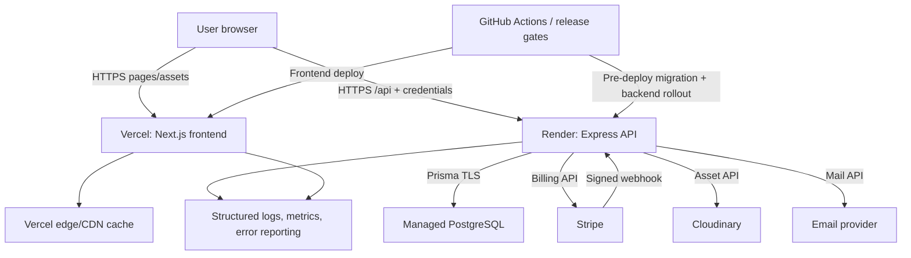

# 24. Deployment, Observability, and Recovery Architecture

## Production topology

The deployment split remains unchanged: Next.js frontend on Vercel, Express API on Render, PostgreSQL through the configured provider, Stripe for billing/webhooks, Cloudinary for assets, and an email provider behind an adapter.

There is no Vercel API deployment, no application-startup migration, and no browser-to-database/provider-secret path.

## Environment contract

| Scope | Required configuration | Validation behavior |
|---|---|---|
| Frontend public | `NEXT_PUBLIC_API_URL` with the Render `/api` base, canonical site origin, optional public telemetry ID | Build fails if production falls back to localhost or a malformed/non-HTTPS origin |
| Backend core | `NODE_ENV`, port, `DATABASE_URL`, frontend exact-origin allowlist, access/refresh/CSRF signing material | Boot fails closed on missing/placeholder values; values are never logged |
| Stripe | secret key, webhook signing secret, allowlisted price/product IDs, API version policy | Production rejects test keys and unknown client price IDs |
| Cloudinary | cloud/account credentials and owned folders/transformation policy | Provider health is not required for liveness; upload fails safely |
| Email | provider key/domain/from address and configured frontend reset origin | Production cannot use console-token delivery |
| Operations | log level, error-reporting DSN, release ID, reconciliation/cleanup schedules | Bounded defaults; sensitive DSNs masked in diagnostics |

Environment names are documented in an example file with dummy values. Preview deployments receive a deliberately managed frontend-origin policy; arbitrary `*.vercel.app` credentialed origins are not accepted. Secrets are rotated through provider/platform secret stores, never committed.

## Health, readiness, and startup

| Probe | Semantics | Response |
|---|---|---|
| `GET /api/health` | Process liveness only | Fast 200 if event loop can serve; minimal body |
| `GET /api/ready` | Ability to receive normal traffic | Bounded DB query plus startup/migration compatibility flag; 200 or 503 |
| Internal diagnostics | Provider/config detail for operators | Authenticated/admin or platform-only, redacted |

Startup validates configuration, initializes adapters, and begins listening only after synchronous prerequisites are valid. It does not require Stripe, Cloudinary, or email to be reachable because temporary provider failure should degrade only the relevant workflow. Readiness fails for database loss or an incompatible migration state. All probes have strict timeouts and do not expose versions, SQL, secrets, or stack traces.

## Migration and deployment sequence

1. CI performs immutable install, lint, typecheck, tests, builds, migration validation, and API diff.
2. Back up/verify restore posture for a high-risk data phase; record current release and migration version.
3. Run expand-compatible migrations with `prisma migrate deploy` in a Render pre-deploy command where available, or a single separately locked CI migration job.
4. Deploy backend code compatible with both pre- and post-backfill data.
5. Wait for readiness, then run read-only smoke checks and monitor errors/latency.
6. Deploy frontend after its required API compatibility is live; use preview smoke before production promotion.
7. Run bounded backfill/reconciliation jobs separately from the web process.
8. Add constraints and later contract old fields only after parity and rollback windows.

Prisma documents `migrate deploy` as the production command for pending migrations ([Prisma migrate deploy](https://docs.prisma.io/docs/cli/migrate/deploy)). Render supports deploy commands and health-based rollout behavior; migration placement and service configuration must follow the current [Render deployment guidance](https://render.com/docs/deploys) and declarative [Blueprint specification](https://render.com/docs/blueprint-spec).

Only one actor may apply migrations for a release. The web start command remains `node dist/server.js`; code generation/build happens before runtime.

## Graceful shutdown

On `SIGTERM`/`SIGINT`, the backend:

1. Marks readiness false.
2. Stops accepting new connections.
3. Allows in-flight requests a bounded drain window.
4. Stops scheduled work and releases/recoverably expires leases.
5. Disconnects Prisma and flushes bounded telemetry.
6. Exits zero when drained or non-zero after the hard deadline.

Webhook work is transactionally leased, so termination before commit can be retried. No long-running reconciliation/backfill executes inside the API process. Render explicitly documents termination during deploy, so shutdown behavior must be exercised rather than assumed ([Render deploys](https://render.com/docs/deploys)).

## Rollout and rollback

- Prefer Render/Vercel platform rollout plus health checks; introduce traffic splitting only if the plan supports it and risk justifies it.
- Frontend rollout occurs after backward-compatible backend rollout. A frontend rollback must continue to understand the API during the overlap window.
- Code rollback never attempts to reverse an irreversible financial/data migration. Expand migrations remain in place while old-compatible code is restored.
- Feature flags are limited to high-risk behavior activation (new entitlement reader, webhook projection, content routes), have owners and removal dates, and default safely.
- A failed migration stops deployment before new code receives traffic. A failed backfill pauses activation, not the existing feature.

Rollback triggers include sustained readiness failures, material 5xx/latency regression, auth restore failures, entitlement discrepancy, duplicate financial conflict, or frontend error-rate/Core Web Vital regression beyond agreed thresholds.

## Observability model

Every request receives or validates a bounded request ID and returns it in the response. Structured JSON logs include timestamp, level, service, environment, release, request ID, route template, method, status, duration, and a pseudonymous principal identifier only where operationally necessary. Provider/event/job correlation fields are bounded and redacted.

### Metrics

| Area | Signals |
|---|---|
| API | Request rate, error rate, duration percentiles, active requests by route template/status class |
| Database | Query latency/errors, pool saturation, transaction retries, migration/backfill progress |
| Auth/security | Login/refresh outcomes, reuse detections, recovery requests, CSRF/origin rejects, rate limits |
| Billing | Checkout, webhook, invoice uniqueness, subscription transitions, reconciliation (defined in doc 21) |
| Media/community | Browse latency, stream decision codes, view dedup, moderation queue size/age, rating recompute errors |
| Frontend | Route error rate, LCP/INP/CLS distributions, hydration errors, key journey conversion |
| Providers | Stripe/Cloudinary/email latency and error class without high-cardinality object labels |

### Traces and errors

Start with request/error correlation and provider timing spans rather than an expensive all-event tracing program. Sampling is higher for errors and critical billing/auth routes, lower for routine public reads. Frontend error reports attach release, route, theme, and request ID where available, but no access token, form content, or user email.

### Alerts

Alerts must be actionable and tied to a runbook. Page immediately for sustained readiness/database failure, payment duplication/conflict, dead-letter financial events, broad auth restore failure, or severe error-budget burn. Ticket or notify for queue age, reconciliation drift, provider degradation, cleanup backlog, and Core Web Vital regression. Avoid alerting on a single expected 4xx.

## Service-level objectives

Initial objectives are baselines to validate with real traffic:

- Public/API availability: 99.9% monthly excluding planned maintenance.
- Core API p95 latency: under 500ms for ordinary reads and under 800ms for ordinary writes, excluding external provider completion.
- Auth restore success: ≥99.5% for valid, non-revoked sessions.
- Verified webhook processing: 99% under 60 seconds; no unresolved paid invoice older than 15 minutes without an alert.
- Readiness detection: database unavailability reflected within 30 seconds.
- Public frontend Core Web Vitals: “good” thresholds at the 75th percentile as specified in doc 22.

Record an error-budget policy before treating these figures as release blockers; assignment-scale low traffic may make percentile windows noisy.

## Backup, restore, and data recovery

- Use managed PostgreSQL automated backups/PITR appropriate to the selected plan; confirm retention and restore capability rather than assuming it.
- Before financial/schema milestones, record a restore point or verified recent backup.
- Conduct a restore drill into an isolated environment, run invariant queries, and document recovery time and recovery point evidence.
- Cloudinary assets are referenced by durable provider IDs; replacement/deletion operations are audited. The database remains the ownership map.
- Stripe is an independent source for billing reconciliation, not a substitute for database backup.
- Content/contact exports follow privacy and access controls; backups inherit retention/deletion policy constraints.

Target recovery objectives require plan confirmation: propose RPO ≤24 hours for general application data (lower where PITR allows) and RTO ≤4 hours for an assignment production service. Billing projection can be reconstructed from Stripe only through a tested bounded reconciliation path; local audit and user-generated data cannot.

## Operational jobs

| Job | Cadence | Safety |
|---|---|---|
| Billing reconciliation | Daily and on demand | Bounded cursor, dry-run default, leased singleton, audited repairs |
| Expired session/reset/checkout cleanup | Daily | Indexed expiry, bounded delete batches, retention policy |
| View dedup cleanup | Daily | Delete expired buckets only; never decrement aggregates |
| Moderation/contact age monitoring | Periodic | Read-only metrics/alerts |
| Backfills | Release-specific | Resumable checkpoint, rate limit, kill switch, separate process |

Jobs use platform cron/background execution when available, never an uncoordinated timer in every web instance.

## Production release checklist

- Required CI gates green and artifacts tied to a release SHA.
- Environment contract validated; production keys/origins/URLs confirmed without exposing values.
- Migration reviewed for locks, duration, compatibility, backup, and single-run ownership.
- `/health` and `/ready` semantics verified; graceful shutdown exercised.
- Vercel frontend calls the Render `/api` base with working cross-origin cookie/CSRF policy.
- Stripe webhook endpoint/signing secret/event types/test delivery verified; reconciliation dry-run clean or exceptions approved.
- Cloudinary and email production adapters pass bounded smoke checks.
- Dashboards, alerts, and runbooks link to the current release.
- Rollback owner, trigger, code version, and database compatibility are recorded.
- Post-deploy public/member/admin smoke checks pass without mutating real billing data.

