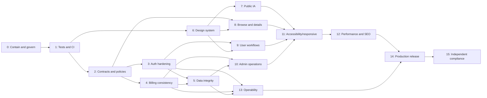

# 26. Phased Migration Roadmap

## Sequencing principle

The roadmap contains **16 independently reviewable phases (0–15)**. It establishes evidence and compatibility before high-risk state changes, then builds visible product scope on stable contracts, and finishes with runtime/production proof. A phase may be split into multiple backlog pull requests; it may not silently absorb later scope.

## Phase 0 — Critical containment and project governance

| Field | Plan |
|---|---|
| Objective | Stop practical reset-token exposure immediately, prevent unsafe production recovery behavior, freeze risky billing changes, and establish the verified implementation baseline. |
| Why now | A plaintext/logged recovery secret is a release blocker; high-risk work must start from corrected source facts and an agreed change/evidence process. |
| Dependencies | None; architecture approval and access to current source/config values without exposing them. |
| Requirements covered | SEC-010/011/012/013/030 (containment only for delivery), ARC-001/012, OPS-026 baseline; P0-01 and partial P0-02. |
| Backend scope | Remove any reset token from logs/responses; retain a generic forgot response; fail closed in production when no real email adapter is configured; add a narrowly scoped redaction assertion or temporary capture seam if test tooling is not yet installed. Document billing change freeze/invariants. |
| Frontend scope | Do not claim email was delivered when the API reports operational unavailability; retain non-enumerating copy and no token display. |
| Schema changes | None. Do not migrate plaintext reset rows yet; expire/invalidate them in Phase 3/5. |
| API changes | Behavioral hardening only: raw token never appears; generic response for accepted requests; stable service-unavailable code for unavailable production delivery without revealing account existence. |
| Security impact | Immediate reduction of account-takeover exposure; production recovery remains unavailable until Phase 3 and therefore cannot be called complete. |
| Tests | Focused captured-log/response assertions for known and unknown emails; manual source/log scan if Phase 1 runner is not yet available. |
| Acceptance criteria | **All six must pass:** (1) no reset token/password/access token/refresh token is present in server output for the recovery path; (2) no raw reset token appears in any recovery API response; (3) known and unknown emails receive the same public response shape and message; (4) production startup or recovery fails closed with a stable operational error when real email delivery is absent, while never disclosing account existence; (5) no payment/subscription behavior, schema, or provider configuration changes are included; (6) the PR records the verified 42-endpoint baseline, five P0 invariants, owner, rollback, and evidence links. |
| Rollback strategy | Revert only the scoped code release if it blocks unrelated startup; never restore token logging/response. Use a corrected forward patch for recovery availability. |
| Likely files/modules | Auth service/controller/validation, logger/redaction helper, recovery frontend copy, implementation tracking docs. No Prisma or deploy file. |
| Recommended Codex reasoning | **Highest** because non-enumeration, fail-closed behavior, and secret handling can be subtly weakened. |
| Human-review checkpoints | Security reviews captured output; product approves temporary unavailable copy; release owner confirms production email state and billing freeze. |
| Explicit exclusions | Email-provider integration, reset-token hash migration, session families, payment repair, UI redesign, dependency upgrades. |

## Phase 1 — Tooling, lint, tests, and CI foundation

| Field | Plan |
|---|---|
| Objective | Establish deterministic quality gates and a thin critical-path safety net. |
| Why now | Zero tests, broken backend lint, and no CI make auth/payment/data changes unsafe. |
| Dependencies | Phase 0 containment and approved test/CI tooling versions. |
| Requirements covered | OPS-001–011; ARC-001; ADR-017. |
| Backend scope | Repair lint configuration, add Vitest/Supertest setup, disposable PostgreSQL harness, provider ports/fakes only where needed by seed tests. |
| Frontend scope | Add Vitest/RTL setup and Playwright critical smoke harness; test auth capability invariant and core state components without redesign. |
| Schema changes | None in production; CI applies existing migrations to disposable DB. |
| API changes | None. Baseline existing response behavior before Phase 2. |
| Security impact | Secret scanning and safe fixture policy; CI artifacts must redact credentials. |
| Tests | Seed return-path, entitlement, rating, validation, auth capability, API smoke, and migration-apply tests. |
| Acceptance criteria | Immutable install, format/lint, both typechecks, seeded tests, Prisma validation/migration apply, both production builds, dependency review, and secret scan run on PR; required checks block merge; no live provider calls; flaky retry does not mask failure. |
| Rollback strategy | Revert individual tooling job/config while retaining passing independent gates; no runtime behavior depends on CI. |
| Likely files/modules | Package dev tooling, lint/test configs, `.github/workflows`, test helpers/fixtures; reviewed manifest changes are expected only in this implementation phase. |
| Recommended Codex reasoning | Normal for config; high for disposable-DB isolation and secret-safe provider fixtures. |
| Human-review checkpoints | Team approves commands, CI minutes, required-check names, dependency choices, and baseline lint debt. |
| Explicit exclusions | Broad coverage target, application refactor, schema changes, live Stripe/Cloudinary/email tests. |

## Phase 2 — Shared validation, errors, responses, policies, and API contracts

| Field | Plan |
|---|---|
| Objective | Make HTTP and authorization boundaries explicit before domain movement. |
| Why now | Later UI/admin/security work depends on stable DTO, validation, error, and policy semantics. |
| Dependencies | Phase 1 gates. |
| Requirements covered | ARC-005–010, ARC-013–017; SEC-021/023–025; OPS-004 API contract portion. |
| Backend scope | Shared path/query schemas, response/error mappers, request IDs, named capability/ownership policies; generate OpenAPI from schemas. Migrate endpoints incrementally without changing business behavior. |
| Frontend scope | Typed API adapters and error normalization; introduce feature query-key factories where touched. |
| Schema changes | None. |
| API changes | Standard envelopes and explicit DTOs; max 50; stable sort/filter allowlists; deprecation headers for pending-review/raw-upload-delete only after replacements are scheduled. |
| Security impact | Removes raw-record exposure and centralizes role/ownership checks; CORS/CSRF implementation remains Phase 3. |
| Tests | Status/error envelope matrix; invalid UUID/query/body; cross-user/admin access; OpenAPI generation and breaking diff. |
| Acceptance criteria | All current 42 endpoints appear in generated docs; every changed endpoint has request/response schemas and policy; raw Prisma objects are absent; request IDs appear in success/errors/logs; contract tests green. |
| Rollback strategy | Endpoint-by-endpoint compatibility adapters; old frontend remains supported through one release. |
| Likely files/modules | Backend validation/middleware/controllers/services, shared DTO/error/policy modules, frontend API/types/query factories, OpenAPI generation. |
| Recommended Codex reasoning | High due to broad contract compatibility; normal for repetitive schema/test additions after pattern approval. |
| Human-review checkpoints | Approve envelope, validation status, `/api` version decision, deprecation window, and external field names. |
| Explicit exclusions | Domain folder mass move, session/payment schema, new pages, style changes. |

## Phase 3 — Authentication, sessions, recovery, CSRF, and route UX

| Field | Plan |
|---|---|
| Objective | Complete secure recovery and durable session-family behavior while preserving in-memory JWT access. |
| Why now | Closes P0 auth recovery and major P1 session/CSRF/cache risks before broader protected workflows. |
| Dependencies | Phases 1–2; approved email provider, lifetimes, session limit, origin policy. |
| Requirements covered | SEC-001–030 excluding trust-proxy runtime proof; ADR-004/005/006; P0-01/02 and auth P1s. |
| Backend scope | Email adapter, hashed reset tokens, atomic session rotation/reuse, current/all/session revoke, session cap/metadata, password change, exact Origin + CSRF, auth rate limits and redaction. |
| Frontend scope | Single-flight restore, capability gates, cache clearing, sessions/security/profile password UI, safe redirects, recovery forms. |
| Schema changes | DB-01/02 plus DB-14 auth expiry indexes using expand/backfill/constraint pattern. |
| API changes | Change refresh/logout/forgot/reset; add session list/revoke/all and password update. |
| Security impact | High: account recovery, credential/session theft, cross-site requests, and cross-user cache isolation. |
| Tests | Full auth integration matrix, concurrent rotation/reuse, CSRF/origin, recovery mail capture, E2E restore/logout/reset, secret-log scan. |
| Acceptance criteria | Raw tokens absent; real test/production-adapter path configured; reset single-use/hash-only; concurrent refresh yields one successor; reuse revokes family; session cap and revoke work; logout removes private cache; lookalike origins/CSRF mismatch fail; protected UI has no false authenticated state. |
| Rollback strategy | Dual-read legacy refresh/reset representations for one token lifetime; kill-switch new session UI, not security checks; invalidate unsafe legacy reset tokens. |
| Likely files/modules | Auth module/services/controllers/middleware, Prisma migrations, email infrastructure, frontend provider/auth/profile-security features. |
| Recommended Codex reasoning | **Highest**. |
| Human-review checkpoints | Security and product approve lifetimes, email sender/copy, five-session behavior, origins, cookie settings, and reset invalidation. |
| Explicit exclusions | New roles, external identity provider, local-storage tokens, broad UI restyle. |

## Phase 4 — Payment and subscription consistency

| Field | Plan |
|---|---|
| Objective | Establish canonical invoice accounting, deterministic subscription projection/entitlement, idempotent webhooks/checkout, refunds, and reconciliation contracts. |
| Why now | Current duplicate transactions, ordering drift, and cancellation access loss are release-blocking financial/product faults. |
| Dependencies | Phases 1–2; approved entitlement/refund/grace rules; DB-03–07 expand migrations may begin here and finalize in Phase 5. |
| Requirements covered | PAY-001–028; SEC-027; P0-03/04/05. |
| Backend scope | Checkout attempts, active prevention, provider idempotency, event ledger/leases, invoice-only transaction creation, event-time CAS, adjustments, derived entitlement, cancel/resume, reconciliation dry-run/manual repair. |
| Frontend scope | Server-authoritative plans and checkout result, pending state, preserved return path, accurate cancel/grace/refund messaging. |
| Schema changes | Expand DB-03–07; retain legacy reads until reconciliation parity. |
| API changes | Change payment/subscription/webhook routes; add plans, checkout outcome, resume, reconcile, repair. |
| Security impact | Webhook signature/raw body preserved; ownership/admin/idempotency enforced; provider data/logs redacted. |
| Tests | Duplicate/out-of-order/timeout/failure fixtures; entitlement clock matrix; initial/renewal/refund revenue; forged callback; reconciliation/repair authorization and audit. |
| Acceptance criteria | One transaction per paid invoice; checkout event/redirect never records revenue or grants alone; stale events cannot regress; canceling retains paid-period access; refund/net totals correct per currency; same keys/events are no-ops; drift report is bounded/dry-run; callback returns to owned sanitized origin page. |
| Rollback strategy | Shadow-write/read and compare new projection; feature flag entitlement reader after parity; never delete financial rows; revert code while expanded schema remains. |
| Likely files/modules | Payments/subscriptions modules, Stripe controller/service/adapter, media entitlement, checkout frontend, admin billing, migrations/jobs. |
| Recommended Codex reasoning | **Highest**. |
| Human-review checkpoints | Finance/product approve invoice identity, grace, refund/dispute access, currencies/timezone, reconciliation auto-repair allowlist, alert thresholds. |
| Explicit exclusions | Custom card processing, multiple billing providers, coupons/tax redesign, destructive historical cleanup. |

## Phase 5 — Database migrations and domain integrity controls

| Field | Plan |
|---|---|
| Objective | Complete/backfill the 18 proposed DB changes and enforce review, report, view, retention, content/contact, and billing invariants. |
| Why now | New UI/admin workflows must not depend on unenforced or ambiguous data. |
| Dependencies | Phase 1 migration harness; Phase 3/4 dual-write code; approved retention decisions. |
| Requirements covered | DAT-001–025, DAT-010–018; DB-01–18; ADR-011/012/020. |
| Backend scope | Review transition/audit transaction, report uniqueness, durable view dedup, cleanup jobs, soft-delete rules, content/contact repositories; bounded backfills and invariant reports. |
| Frontend scope | No major pages; compatibility adapters may surface explicit lifecycle states. |
| Schema changes | Apply the exact DB-01–18 sequence; evidence-led indexes; constraints only after clean backfill. |
| API changes | Review/report/content/contact contracts can be introduced behind capability/route flags; raw upload deletion deprecation not removed yet. |
| Security impact | Financial retention/anonymization, HMAC viewer privacy, contact/audit access, asset ownership metadata. |
| Tests | Empty/upgrade migrations twice, concurrency/uniqueness/FK behavior, rating transactions, view dedup, cleanup and rollback-compatibility. |
| Acceptance criteria | Every change has migration/backfill/verification/rollback evidence; no ambiguous financial duplicate is coerced; approved-only ratings match recomputation; duplicate reports/views are prevented; old-compatible release reads expanded schema; query plans meet agreed bounds. |
| Rollback strategy | Expand/dual/constraint/contract across releases; pause backfills with checkpoint; restore compatible code without down-migrating finance/audit data. |
| Likely files/modules | Prisma schema/migrations, auth/payment/review/analytics/contact/content repositories and jobs. |
| Recommended Codex reasoning | **Highest** for finance/auth/backfill/FK; high for review/view; normal for new isolated tables after design approval. |
| Human-review checkpoints | DBA-like migration review, duplicate exception list, retention/privacy, backup/restore point, index plans, content seed review. |
| Explicit exclusions | Account-table removal until proven unused, generic activity warehouse, Redis, complex CMS. |

## Phase 6 — Design system, themes, and shared UI

| Field | Plan |
|---|---|
| Objective | Establish tokens, light/dark/system themes, accessible primitives, and shared async/form state grammar. |
| Why now | Missing pages and admin expansion should not multiply inconsistent components. |
| Dependencies | Phase 1 frontend tests; approved visual direction and logos. |
| Requirements covered | UI-001–010, UI-027, UI-044/045 foundations; ADR-014. |
| Backend scope | None. |
| Frontend scope | Tokens, theme boot/provider/toggle, app/auth/admin layouts, required shadcn primitive inventory, shared card/form/state/table/chart building blocks. |
| Schema changes | None. |
| API changes | None. |
| Security impact | Theme persistence stores no sensitive data; hydration bootstrap must support CSP direction. |
| Tests | Light/dark/system first paint, hydration, reduced motion, primitive keyboard/focus, form associations, visual snapshots at representative sizes. |
| Acceptance criteria | Both themes meet measured contrast for core controls; no hydration flash/error; all required shared components have a single owned implementation and documented states; keyboard/dialog behavior passes; existing key routes remain usable. |
| Rollback strategy | Token compatibility layer maps prior classes; migrate route-by-route; revert individual component adoption without removing foundational tokens. |
| Likely files/modules | Frontend globals, providers, components/ui/shared, theme/config/test files. |
| Recommended Codex reasoning | High for theme hydration/accessibility; normal for token/component application. |
| Human-review checkpoints | Design approves colors/type/radius/motion; accessibility reviews focus/contrast; product approves state copy. |
| Explicit exclusions | Page rewrites, novelty animation, duplicate component wrappers, charts with fake data. |

## Phase 7 — Public information architecture, contact, and content

| Field | Plan |
|---|---|
| Objective | Replace placeholder navigation and add truthful About, Contact, Blog, Help, Privacy, Terms, Pricing, and real-data home composition. |
| Why now | Mandatory visible pages and dead footer routes are P1; design system/data models now exist. |
| Dependencies | Phases 2,5,6; approved copy/retention/email notification. |
| Requirements covered | UI-011–018, UI-029; DAT-019–025. |
| Backend scope | Home aggregation, contacts create, published content list/detail, optional notification after persistence. |
| Frontend scope | Eight home sections, required public pages, contact form, blog list/detail, footer/navigation/metadata baseline. |
| Schema changes | Uses DB-10/11; no additional model. |
| API changes | Add home, contacts, content posts, plans (if not Phase 4). |
| Security impact | Spam/rate controls, safe content rendering, admin-only draft isolation, contact privacy/no-store. |
| Tests | Public route/link crawl, home state per section, contact validation/abuse/persistence/provider failure, published/draft content/SEO. |
| Acceptance criteria | All required public routes resolve with owned non-placeholder content; home has eight meaningful manageable-data sections or intentionally omits empty sections; contact persists once; drafts never leak; footer has no placeholder links. |
| Rollback strategy | Routes/sections independently flaggable; retain persisted contact/content data; notification failure cannot roll back submission. |
| Likely files/modules | Home/contact/content backend modules, frontend home/content/contact/legal routes/features, footer/header. |
| Recommended Codex reasoning | High for content safety/contact privacy; normal for static page composition. |
| Human-review checkpoints | Product/legal approves copy; privacy approves retention; editorial owner/seed; email notification decision. |
| Explicit exclusions | General CMS, fake statistics/testimonials/partners, arbitrary HTML/page builder. |

## Phase 8 — Browse, media cards, details, and content quality

| Field | Plan |
|---|---|
| Objective | Deliver coherent searchable browse/detail experiences with stable URL/API behavior and complete states. |
| Why now | Core discovery quality is central to CineTube and can now rely on shared contracts/components. |
| Dependencies | Phases 2,5,6; media data/content quality checkpoint. |
| Requirements covered | UI-009/010, UI-019–026, UI-048/049; performance portions of UI-050/051. |
| Backend scope | Typed browse filters/sorts/counts, related query, safe detail/stream DTO, view dedup integration, query-plan tuning. |
| Frontend scope | URL filter/search/sort/pagination, mobile filter sheet, responsive card/grid, detail hierarchy, reviews/comments/related, not-found/error/skeleton, watch/entitlement action. |
| Schema changes | Uses DB-15/16/18; cast/director/gallery changes excluded pending value decision. |
| API changes | Change media list/detail/stream/view; add related endpoint. |
| Security impact | Premium URL never in unauthorized DTO; filters/sorts allowlisted; view fingerprint is HMAC/minimized. |
| Tests | Filter permutation/contracts, query bounds/plans, card/state components, mobile/keyboard browse, free/premium stream negative tests, metadata seed. |
| Acceptance criteria | Shareable URL reproduces results; all filters validated and max 50; deterministic pagination; no N+1 regression; each core state renders; premium URL absent before grant; cards have useful fallback/content; mobile filters work without overflow. |
| Rollback strategy | Preserve old media adapter/route while new components roll out; indexes removable after observation; view counter can fall back to approximate aggregate without decrementing history. |
| Likely files/modules | Media/genres/analytics/review modules, browse/media frontend features and routes, shared cards/filters. |
| Recommended Codex reasoning | High for entitlement/query behavior; normal for component decomposition. |
| Human-review checkpoints | Product approves filter/sort vocabulary and data gaps; design/content review details/cards; performance reviews plans. |
| Explicit exclusions | Recommendation ML, Redis, fabricated cast/gallery data, infinite scroll. |

## Phase 9 — User dashboard, profile image, password, sessions, subscription UX

| Field | Plan |
|---|---|
| Objective | Complete member self-service and personal dashboard workflows. |
| Why now | Auth/payment/data foundations exist, avoiding UI that invents state. |
| Dependencies | Phases 3–6 and core browse. |
| Requirements covered | SEC-008/022, DAT-018/026–030, UI-031–033, PAY-006/007/016/017 presentation. |
| Backend scope | Dashboard overview, owned profile asset attach/remove, recent-view summaries, session/password/subscription DTO refinements. |
| Frontend scope | Dashboard overview/watchlist/reviews/subscription/profile/security, image workflow, password/session controls, accurate cancel/resume/period messaging. |
| Schema changes | Uses DB-01/12/17/18. |
| API changes | Add dashboard overview/profile image; consume session/password/payment additions. |
| Security impact | Private no-store data, owned asset/session policies, cross-user cache removal, password reauthentication policy. |
| Tests | DTO ownership/privacy, upload spoof/replace/delete failures, dashboard states, password/logout effects, cancel/return/resume E2E. |
| Acceptance criteria | Every required member metric/state is server-defined; image replacement/deletion is ownership-safe; password update revokes other sessions; security sessions manageable; private cache cannot cross users; cancellation messaging matches entitlement. |
| Rollback strategy | Independently disable new dashboard panels/image mutations; retain session/password security APIs; orphan cleanup repairs provider failures. |
| Likely files/modules | Profile/auth/upload/analytics/subscription backend; dashboard/profile/subscription frontend features. |
| Recommended Codex reasoning | High for ownership/session/payment state; normal for dashboard layout. |
| Human-review checkpoints | Product approves recent-activity definition/privacy, image policy, password reauth, member navigation. |
| Explicit exclusions | Social profiles, detailed surveillance activity feed, direct browser uploads. |

## Phase 10 — Admin expansion, moderation, content, contacts, users, billing, charts

| Field | Plan |
|---|---|
| Objective | Provide seven meaningful admin areas with audited operations, defined metrics, required tables, and bar/line/donut charts. |
| Why now | Admin UI depends on stable audits, finance ledger, content/contact data, and shared tables/charts. |
| Dependencies | Phases 2,4–7,9. |
| Requirements covered | SEC-026, PAY-022–026, DAT-002–008/021/024, UI-030/034–042. |
| Backend scope | User/subscription/contact/content/review/report list/detail/mutations, analytics aggregates, reconciliation/repair exposure, audit. |
| Frontend scope | Admin nav; responsive tables/forms/timelines; media CRUD; moderation; users; billing; contacts; content; metric/chart definitions and text alternatives. |
| Schema changes | Uses DB-06/08–11/15–17; no generic ACL/audit warehouse. |
| API changes | Admin additions listed in doc 19; deprecate old pending review/raw upload delete only after replacements. |
| Security impact | Admin capability per operation, final-admin protection, contact no-store, repair double-confirm/audit, content sanitization. |
| Tests | Normal-user denial, filters/pagination, optimistic conflicts, moderation/rating, finance aggregates/currency, chart data/empty/a11y, full admin E2E. |
| Acceptance criteria | At least seven meaningful nav areas operate; required tables/actions have complete states; all privileged mutations are policy-protected/audited; all required metrics have defined queries/time/currency; bar/line/donut charts use real data and text alternatives; revenue has no duplicates. |
| Rollback strategy | Route/capability flags per admin area; never remove audit/finance data; old moderation alias remains during overlap. |
| Likely files/modules | Admin/users/payments/subscriptions/reviews/contact/content/analytics backend and admin frontend features. |
| Recommended Codex reasoning | **Highest** for financial repair/aggregates/permissions; high for moderation; normal for table/chart composition. |
| Human-review checkpoints | Admin workflow/state permissions, metric definitions/timezone/currency, suspension policy, repair approvals, content/contact operations. |
| Explicit exclusions | Meaningless settings route, multi-role ACL, arbitrary BI builder, automated destructive repairs. |

## Phase 11 — Accessibility and responsive hardening

| Field | Plan |
|---|---|
| Objective | Verify and correct keyboard, screen-reader, zoom, touch, motion, contrast, and responsive behavior across completed routes. |
| Why now | Runtime accessibility cannot be proven before the actual workflows exist. |
| Dependencies | Phases 6–10 feature complete. |
| Requirements covered | UI-021, UI-043–047; accessibility/non-functional OPS-005. |
| Backend scope | Only error semantics/content required to support accessible UI; no domain redesign. |
| Frontend scope | Landmarks/headings/skip, focus order/trap/return/Escape, form error association, tables/charts alternatives, alt text, reduced motion, touch targets, overflow fixes. |
| Schema changes | None. |
| API changes | None unless inaccessible ambiguity exposes a missing stable error/state code. |
| Security impact | Ensure access-denied/auth states remain distinguishable without leaking data. |
| Tests | axe baseline; keyboard journey suite; manual representative screen reader; 320/375/768/1024/1440 and 200% zoom; reduced-motion/theme matrix. |
| Acceptance criteria | Core journeys complete by keyboard; dialogs focus/escape/return correctly; forms announce errors; no horizontal page overflow at target sizes/zoom; contrast/touch/alt/table/chart criteria pass; remaining issues documented without claiming WCAG compliance. |
| Rollback strategy | Small route/component corrections; preserve accessible primitive behavior; no broad layout rewrite. |
| Likely files/modules | Frontend shared primitives/layouts and every user-facing route test. |
| Recommended Codex reasoning | High for focus/state interactions; normal for isolated styling corrections. |
| Human-review checkpoints | Accessibility specialist/user testing, design review of responsive compromises, product copy clarity. |
| Explicit exclusions | Unsupported conformance claim, aesthetic redesign, animation expansion. |

## Phase 12 — Performance, SEO, images, and metadata

| Field | Plan |
|---|---|
| Objective | Optimize measured bottlenecks and complete discoverability metadata without premature infrastructure. |
| Why now | Stable pages allow meaningful bundle, query, image, and Web Vitals measurement. |
| Dependencies | Phases 7–11. |
| Requirements covered | UI-026, UI-048–052; performance portions of ARC/UI. |
| Backend scope | Query counts/plans, bounded dashboard/home aggregation, cache headers for safe public DTOs, eliminate measured N+1. |
| Frontend scope | Server/client boundary refinement, image sizes/Cloudinary transforms, route-local dynamic imports, rerender/query tuning, metadata/canonicals/social/structured data. |
| Schema changes | Only evidence-approved DB-15 indexes already planned. |
| API changes | Cache headers/ETags may be additive; response meaning unchanged. |
| Security impact | Never cache personalized data publicly or embed premium/private/provider values in metadata. |
| Tests | Lighthouse/lab baseline, bundle diff, query count/EXPLAIN, image layout shift, metadata/structured-data validation, private-cache tests. |
| Acceptance criteria | Public routes meet agreed lab budgets with a production telemetry plan; no private cache leakage; charts/editors absent from unrelated bundles; responsive images prevent material CLS; required routes have unique accurate metadata; query regressions are evidenced and fixed. |
| Rollback strategy | Remove individual cache/dynamic/index optimization if correctness regresses; keep stable contracts. |
| Likely files/modules | Next route layouts/metadata, image/media components, query adapters, backend aggregates/index migrations. |
| Recommended Codex reasoning | High for caching/server-client/privacy; normal for metadata/image mechanical work. |
| Human-review checkpoints | SEO/product copy, performance budget, production telemetry consent, query-plan review. |
| Explicit exclusions | Redis/CDN personalization, speculative indexes, aggressive animation, unsupported SEO claims. |

## Phase 13 — Observability, health, graceful shutdown, jobs, and recovery readiness

| Field | Plan |
|---|---|
| Objective | Make failure detectable, diagnosable, and recoverable before production rollout. |
| Why now | Stable behavior is needed to define useful signals; production cannot safely launch without readiness/shutdown/payment alerts. |
| Dependencies | Phases 3–5 and 12 baseline; approved monitoring platform/retention. |
| Requirements covered | ARC-011/018; SEC-028–030; PAY-023/026; OPS-016–022 foundations. |
| Backend scope | Structured/redacted logging, request/release IDs, liveness/readiness, exact `trust proxy`, graceful shutdown, job leases/schedules, metrics/error reporting/runbooks. |
| Frontend scope | Error/performance reporting with privacy controls and request IDs; useful error recovery. |
| Schema changes | Operational indexes/leases already in DB-03/14/18; no observability event warehouse. |
| API changes | Add `/ready`; minimize `/health`; headers/request IDs; internal diagnostics protected. |
| Security impact | Log redaction/cardinality/privacy, probe minimization, correct client IP/protocol trust. |
| Tests | DB-down readiness, liveness independence, SIGTERM drain, stale job lease, captured secret logs, synthetic errors/alerts, preview proxy/IP behavior. |
| Acceptance criteria | DB failure returns readiness 503; health remains fast/minimal; SIGTERM drains within deadline; jobs do not double-run; critical auth/payment/upload failures correlate without secrets; alerts fire into tested runbooks; trust-proxy behavior is verified on Render. |
| Rollback strategy | Telemetry/adapters can be disabled without disabling redaction; readiness may use a conservative fallback; job scheduler kill switch preserves ledger data. |
| Likely files/modules | Server/app/config/middleware/logger/health/jobs, frontend error/performance provider, monitoring/runbooks. |
| Recommended Codex reasoning | High for shutdown/proxy/redaction/jobs; normal for dashboards/runbook wiring. |
| Human-review checkpoints | Operations/security approve probes, retention, alerts, SLOs, proxy hop, on-call ownership. |
| Explicit exclusions | Full distributed tracing platform, high-cardinality user metrics, web-process cron. |

## Phase 14 — Deployment, migrations, rollback, and production verification

| Field | Plan |
|---|---|
| Objective | Execute the Vercel/Render release with migration, backup, configuration, rollback, and smoke evidence. |
| Why now | All required functionality and operability must be green before production state changes. |
| Dependencies | Phases 1–13; production providers/domains/secrets/backups approved. |
| Requirements covered | OPS-012–025; deployment ADR-018. |
| Backend scope | Render pre-deploy migration, environment validation, health/readiness rollout, production provider/webhook/config smoke. |
| Frontend scope | Vercel preview/prod deployment, exact Render `/api`, cross-origin cookie/CSRF, route smoke and telemetry check. |
| Schema changes | Run reviewed pending expand/constraint migrations only; contract migrations require separately proven window. |
| API changes | None unreviewed at release; generated contract artifact matches deployment. |
| Security impact | Production/test key separation, exact origins, no localhost fallback, secure cookies, secrets in platform stores. |
| Tests | Full CI; preview E2E; migration upgrade; backup restore evidence; post-deploy public/member/admin/payment-safe smoke; rollback drill. |
| Acceptance criteria | Single migration actor succeeds; backend readiness green before frontend promotion; production frontend uses HTTPS Render `/api` with no localhost references; cookie/CORS/CSRF work; Stripe webhook/provider adapters verified safely; backups/restore and rollback drill recorded; smoke/alerts green. |
| Rollback strategy | Revert frontend then backend to compatible release; expanded schema remains; pause flags/jobs; execute runbook trigger/owner/verification; never destructive down-migrate finance. |
| Likely files/modules | CI/release workflows, Render/Vercel settings/config, migration scripts, smoke/runbook docs; deploy manifests only through reviewed implementation changes. |
| Recommended Codex reasoning | **Highest** for migration/config/rollback; normal for executing documented smoke steps. |
| Human-review checkpoints | Release owner approval, secret/domain/provider confirmation, DBA backup/migration, product smoke, security CORS/cookie review. |
| Explicit exclusions | Unreviewed feature work, provider live charges, destructive migration, Vercel backend. |

## Phase 15 — Final Gladiator compliance and independent review

| Field | Plan |
|---|---|
| Objective | Prove every traceability row and definition-of-done item with independent evidence and resolve exceptions. |
| Why now | “Implemented” is not equivalent to production-ready or requirement-complete. |
| Dependencies | Successful Phase 14 deployment and runtime observation window. |
| Requirements covered | OPS-026 and every still-open traceability row. |
| Backend scope | Correct only evidence-backed defects; run invariants/security/finance/content/config scans. |
| Frontend scope | Cross-route content, accessibility, responsive, theme, metadata, state, and broken-link audit. |
| Schema changes | None unless a separately approved corrective migration is required. |
| API changes | None unless a separately approved defect fix is required. |
| Security impact | Independent authz/secret/session/payment/PII review and production log sampling. |
| Tests | Full required CI plus production-safe smoke, manual accessibility/responsive/provider/recovery review, reconciliation dry-run. |
| Acceptance criteria | Every requirement has evidence or an explicitly accepted exception; no P0/P1 remains; no placeholder/localhost/sensitive logs; financial/review invariants clean; DoD signed; architecture divergences recorded in ADRs; independent reviewer approves or returns bounded findings. |
| Rollback strategy | Audit itself is read-only; corrective work returns to the owning phase/backlog item and follows its rollback. |
| Likely files/modules | Traceability/DoD/evidence reports; only bounded defect fixes in separately scoped PRs. |
| Recommended Codex reasoning | **Highest** for cross-system contradiction/risk analysis; normal for mechanical link/content scans. |
| Human-review checkpoints | Independent architect, product, security, accessibility, operations, and assignment owner sign-offs as applicable. |
| Explicit exclusions | New scope, architecture rewrite, marking unresolved requirements complete. |

## Critical path and parallel work

Phases 3 and 4 can proceed in parallel only after Phase 2 and with separate migration ownership; both converge before Phase 5 constraints. Phase 6 can begin after Phase 1 because it does not depend on billing, but visible routes must not invent unstable subscription data. Phases 7–10 may be parallelized by feature once shared contracts/data exist. Phases 11–15 are convergence gates and should not be bypassed by parallel delivery.

## Five highest-risk migrations

1. Transaction invoice-identity backfill/deduplication without rewriting financial history.
2. Subscription projection and entitlement cutover across delayed/out-of-order Stripe events.
3. Refresh-token family migration while live rotating sessions exist.
4. Password-reset hash cutover with deliberate invalidation of plaintext legacy tokens and real email delivery.
5. User-deletion/financial-retention FK change plus immutable customer snapshots.

